# Getting Started

## Intro
This is an open source project that was created to provide strategies and platforms for business-focused cloud computing.
This project is based on 30 years of experience across multiple languages, platforms and architectures.

The strategy is based on experience and not theories.
It is not an all or nothing strategy.
You can use it for part or all of your applications.
It is build to interoperate with current code instead of trying to replace all existing code.

It is recommended, but not required, to use the [Architecture-First](https://tonymarius.substack.com/p/architecture-first-strategy?utm_source=url) strategy to develop these items as well as items outside this project.
The project is part of a Business Oriented Architecture and called BOA.


It is important to understand that BOA is not an all or nothing architecture.
The BOA approach can and wants to coexist with current applications and solutions.
That is the real world and is welcomed.

The BOA approach takes advantage of the power of the Cloud-Centric environments.

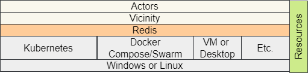

The main requirements for using the BOA platform are access to Redis for core communication and support for the messaging protocol.
As shown above, the platform is a layer on top of existing Cloud and On-Prem solutions.

## Overview

It is recommended to read some of the documentation before installing.
An overview of BOA can be found [here](docs/programming/Overview.md).

## Installation
The installation instructions are based on Linux whether as the core operating system or a structure such as Windows WSL 2.

### Install Java 17

The application is based on Java version 17+.

https://docs.aws.amazon.com/corretto/latest/corretto-17-ug/downloads-list.html

Use the link above or an equivalent download link from a different vendor.

Add JAVA_HOME to the PATH.

```shell
$ export JAVA_HOME=/c/Users/boa/.jdks/corretto-17.0.3
$ echo $JAVA_HOME
/c/Users/boa/.jdks/corretto-17.0.3
```

### Install Maven

Maven is required to build the application.

```shell
sudo wget http://repos.fedorapeople.org/repos/dchen/apache-maven/epel-apache-maven.repo -O /etc/yum.repos.d/epel-apache-maven.repo
sudo sed -i s/\$releasever/6/g /etc/yum.repos.d/epel-apache-maven.repo
sudo yum install -y apache-maven
mvn –version
```

Above is a technique to install Maven via yum.
Please use the appropriate tool for your environment.

### Install Git

Install Git from a trustworthy source, such as https://git-scm.com/book/en/v2/Getting-Started-Installing-Git.
There is specific version for Windows: https://git-scm.com/download/win

The successful download should include Git Bash.

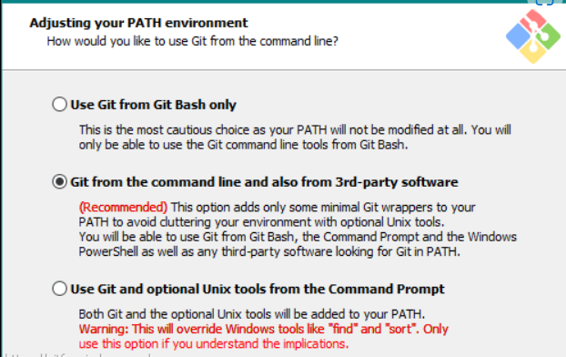

### Clone the boa-showcase project

git clone https://github.com/architecture-first/boa-showcase.git

### Install Docker Desktop (recommended on Windows)

https://docs.docker.com/desktop/install/windows-install/

Make sure that you have the recommended RAM and disk space
After successful installation, launch Docker Desktop application and proceed to the Settings.


To get to the settings page, click the upper right corner of the windows

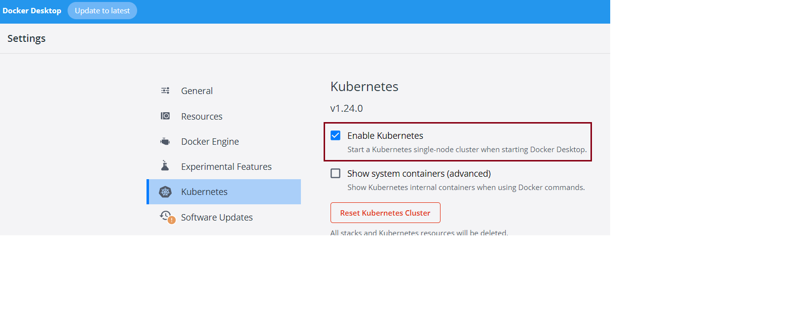

If you are planning to run in Kubernetes enable Kubernetes in the settings.


## Run the Retail Showcase Application

The retail showcase application contains running code based on the platform.
It should only be used for reference.
The solution consists of the following components

- **MongoDB**
  - This NoSql database fits nicely with a BOA approach
    - Note: The BOA approach will work just as well with a relational database
- **Redis**
  - Redis is a comprehensive memory database for high performance access.
- **NodeJS**
  - This component is not required for BOA applications, but shows a nice way to handle websocket communication with particular clients.
  - BOA solutions encourage asynchronous push communication rather than blocking synchronous communication.
- **Browser** (from the user's desktop)
  - index.html
    - Contains basic HTML5 and JavaScript to demonstrate code to interact with BOA Actors.
      - The BOA platform can work with any library, such as Angular, React, Vue, Svelte, etc.
    - This is a reference application is intentionally not focused on look and feel.
- Actors
  - **Customer**
    - Represents the User and interacts with the User's browser for communication
      - It is connected to both the Vicinity and the Client.
      - All users in this showcase application are **anonymous**
        - The temporary information is stored in the LocalStorage and SessionStorage.
  - **Merchant**
    - Responsible for the product and inventory portion of the application.
  - **Cashier**
    - Responsible for accepting payment and processing orders.
    - All payment and processing is faked
  - **Identity Provider**
    - Responsible for providing a valid Access Token (JwtToken).
  - **Security Guard**
    - Responsible for validating messages and reporting security incidents
  - **Vendor**
    - Deliver supplies for updating inventory
  - **Advertiser**
    - Produces advertisements based on data analysis
    - This Actor represents dynamic behavior without custom Java coding
      - It executes based on a developer defined script and interacts with a sidecar component for custom processing
- Messages
  - **business-retail**
    - The repository of ArchitectureFirst events for communication
      - If you are using a common language, such as Java you can create a custom business library for the application.
      - Otherwise, there should be a common message format that allows the Actors to consume the messages.
- Platform
  - **vicinity-platform**
    - The runtime that defines the Vicinity and Actors base functionality
    - This library will be kept in a Maven Repository in the near future.


You can start with the retail showcase application and modify it for your particular application.

### Docker Compose

This is the easiest option if you don't know Kubernetes yet.

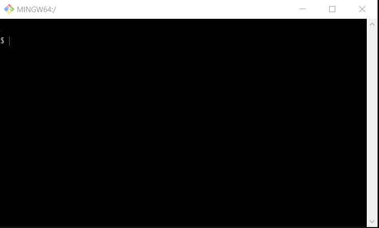

Open a Bash session, such as Git Bash.

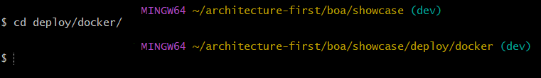

Change directory to the project root directory where the repository was cloned to.
Next Change the directory to the 'deploy/docker' directory

Run the following command (may need to run as sudo if there are privileges issues): 
```shell
$. ./run-retail.sh up
```
Note: if the file is not executable then run the following command.

```shell
chmod a+x run-retail.sh
```

**Alternative**: if deploying to a server as docker-compose outside of docker desktop

```shell
sudo ./run-retail-alt-1.sh up
```

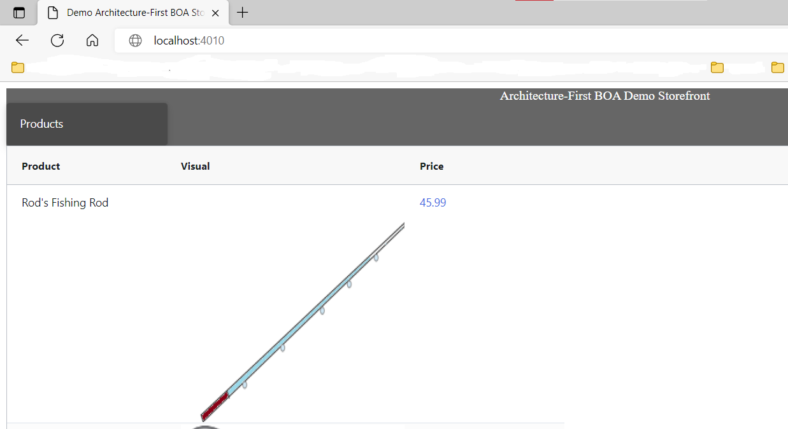

Go to the browser and location http://localhost:10010.

Follow "Using the retail showcase application" instructions later in this document.

### Kubernetes

This option requires Kubernetes knowledge, but is preferred.


Open a Bash session, such as Git Bash.


Change directory to the project root directory where the repository was cloned to.
Next change directory to 'deploy/k8s'.

Create a private Registry (may need to run as sudo if there are privileges issues)

```shell
docker run -d -p 5000:5000 --restart=always --name local-registry registry:2
```

Run the following command (may need to run as sudo if there are privileges issues).

```shell
$ bash run-retail-k8s.sh --build-and-install
```

Note: if the file is not executable then run the following command.

```shell
chmod a+x run-retail-k8s.sh
```
Note: At this time, it may take 1-2 minutes for the Actors to register the first time.
Wait 2 minutes then go to the browser and location http://localhost:30020.

**Alternative**: if deploying to a server, you can create a custom script to compile java, build images and deploy via Kustomize.

## Using the retail showcase application

Note: If you are rebuilding the application after the initial deployment clear tokens as shown below.

Perform the following actions.
1. View products upon first load

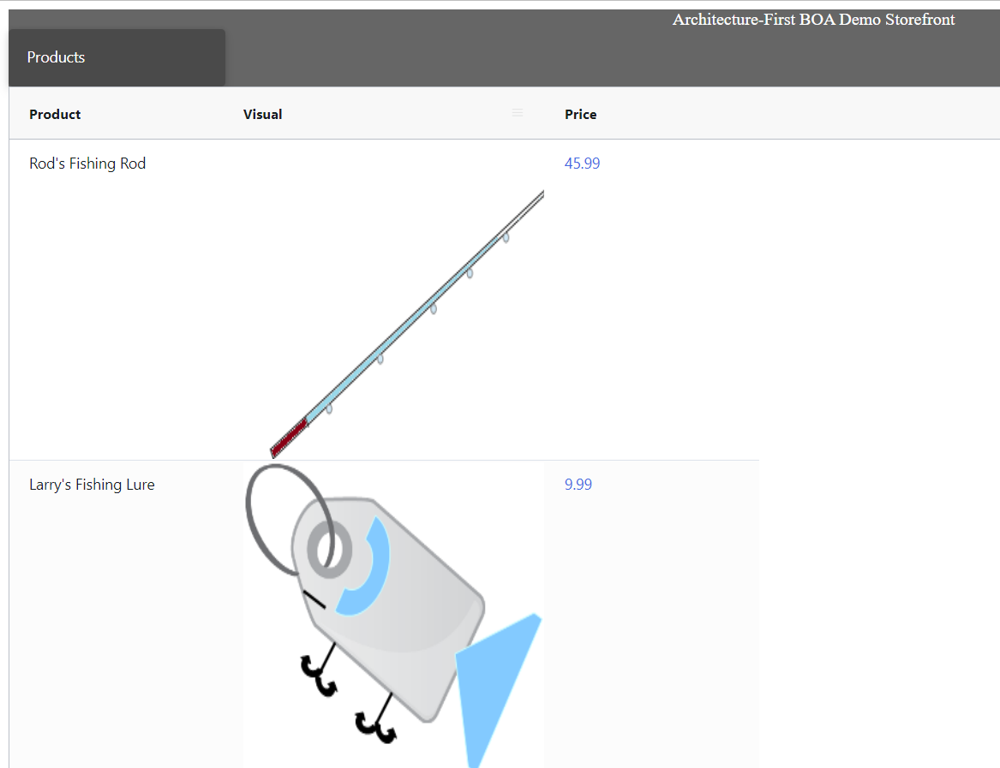

2. Click on a product to view and then choose close

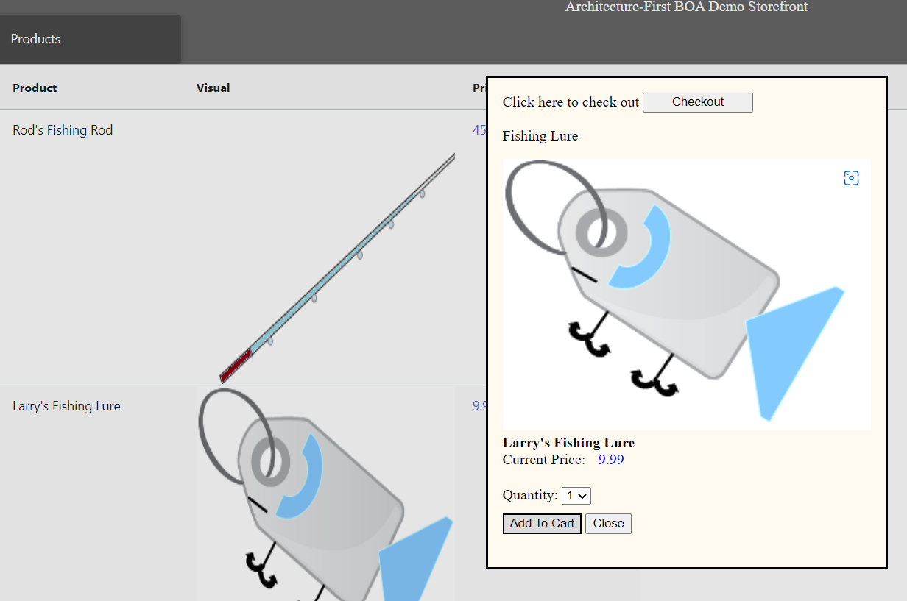

3. Register
   1. Click Login
   
 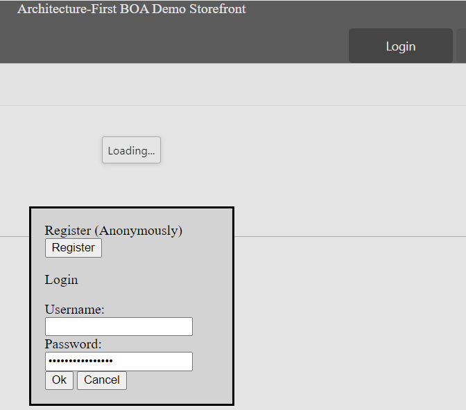

   2. Click Register

 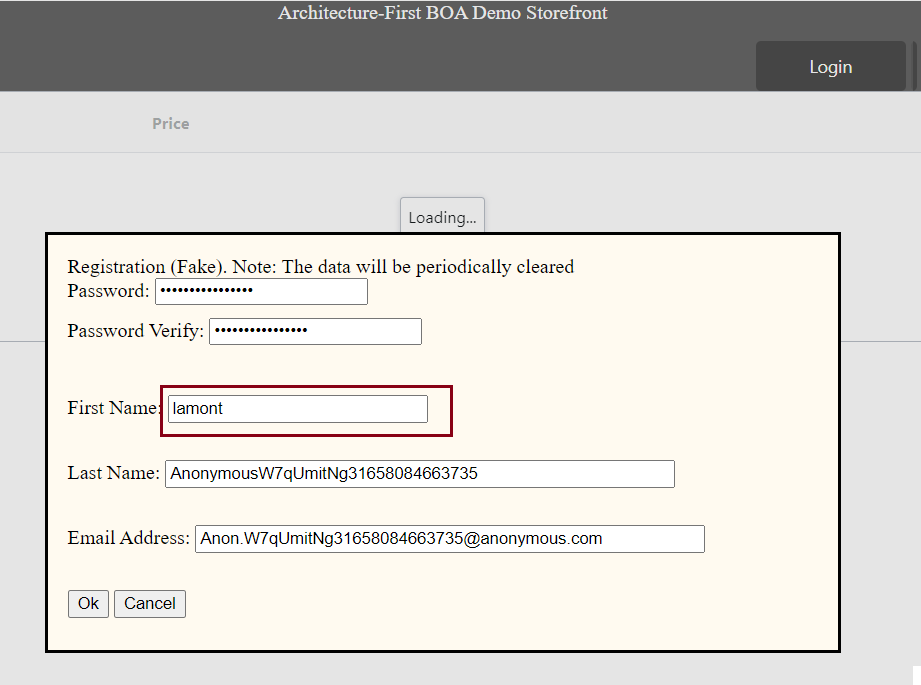

Create any name.
An anonymous user is entered in the database for this user.

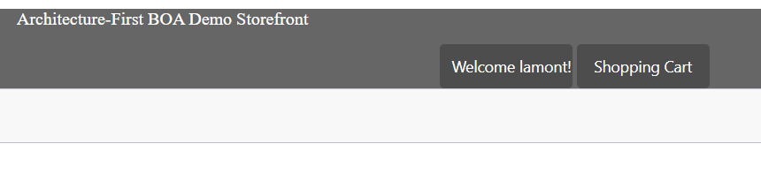

4. Click on a product again


5. Add to Cart
   
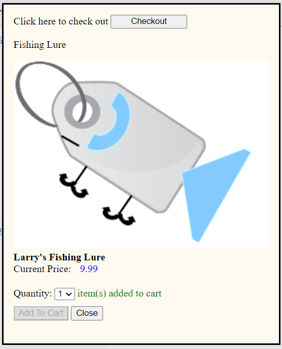

Close the Add to Cart window.

6. View shopping cart

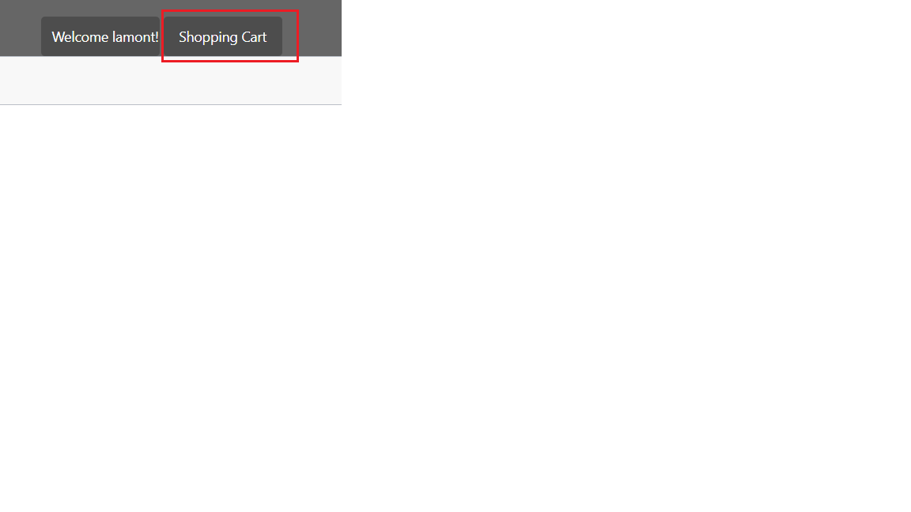

7. Checkout

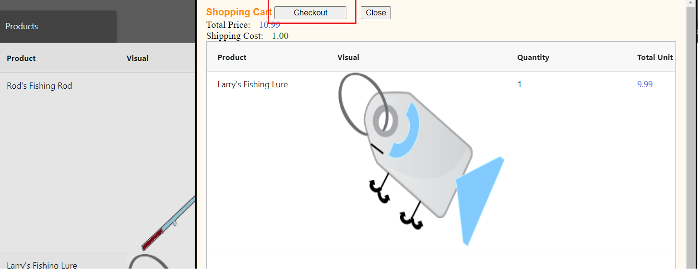

8. View Order Confirmation

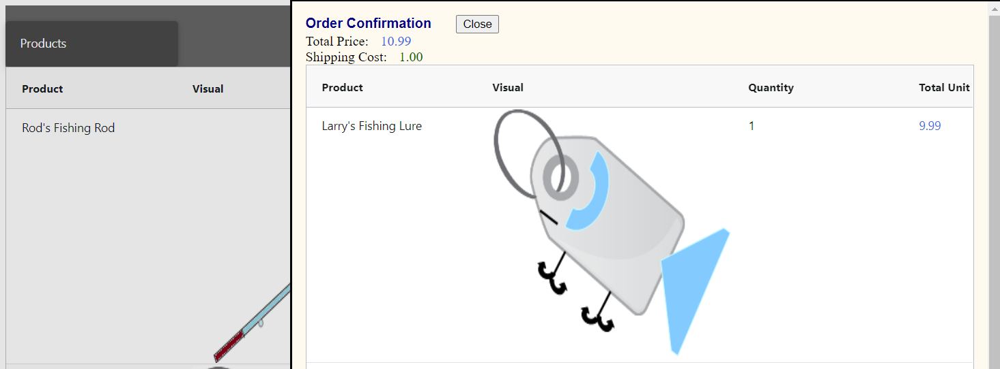

This is the end of a workflow through the retail showcase application.
You can close the Order Confirmation now.

## Monitoring

To see the Bulletin board, Task lists and Convos, you can install [Redis Commander](docs/programming/Tips-and-Tricks.md#install-redis-commander).

## Resetting the environment.

If you have already run through the tutorial and want to clear the environment perform the following steps.

### Remove Anonymous User ID

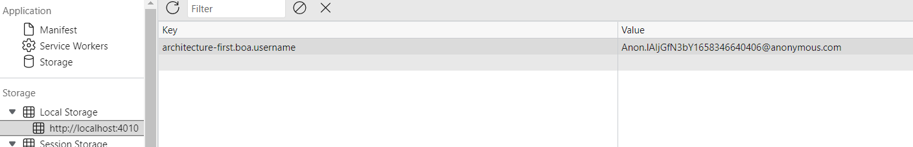

Delete the stored User ID.

### Clear User Token

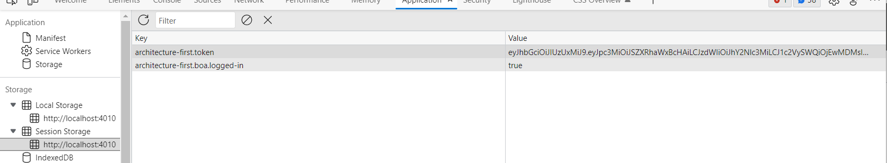

Delete the two entries above.

## Tutorials
- [Tutorial: Hello Actor](docs/programming/Tutorials-Hello-Actor.md)
- [Tutorial: Merchant Convo](docs/programming/Tutorials-Merchant-Convo.md)

## Links

- [Overview](docs/programming/Overview.md 'Overview')
- [Concepts](docs/programming/Concepts.md)
- [Vicinity Features](docs/programming/Vicinity-Features.md 'Vicinity Features')
- [Actor Features](docs/programming/Actor-Features.md)
- [Messaging](docs/programming/Messaging.md)
- [Special Features](docs/programming/Special-Features.md)
- [Troubleshooting](docs/programming/Troubleshooting.md)
- [Tips and Tricks](docs/programming/Tips-and-Tricks.md)

## Key Contributors

- [Tony Marius](https://www.linkedin.com/in/tony-marius-05a1898/) - original author, Technical Architect
- [Paul Parrone](https://www.linkedin.com/in/paulparrone/) - author of Lush, Technical Architect
- [Bill Reeder](https://www.linkedin.com/in/bill-reeder-98869b12/?lipi=urn%3Ali%3Apage%3Ad_flagship3_people_connections%3B246w9rHIQxWeEL38zcmFMg%3D%3D) - Cloud-Computing Architect

