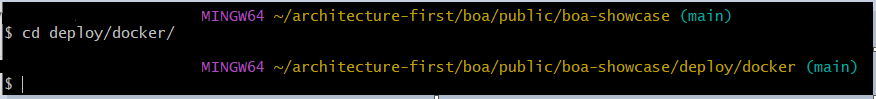
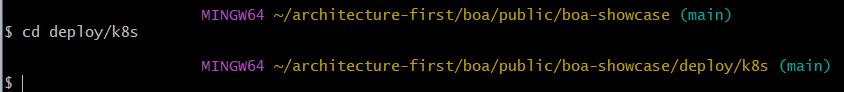
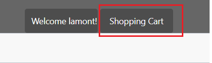
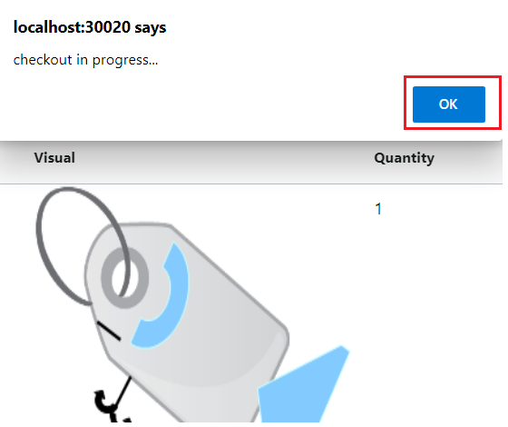

# Getting Started

## Intro
This is an open source project that was created to provide strategies and platforms for business-focused cloud computing.
This project is based on 30 years of experience across multiple languages, platforms and architectures.

The strategy is based on experience and not theories.
It is not an all or nothing strategy.
You can use it for part or all of your applications.
It is build to interoperate with current code instead of trying to replace all existing code.

It is recommended, but not required, to use the [Architecture-First](https://tonymarius.substack.com/p/architecture-first-strategy?utm_source=url) approach to develop these items as well as items outside this project.
The project is part of a Business Oriented Architecture and called BOA.


## Overview
An overview of BOA can be found [here](docs/programming/Overview.md).

The installation instructions are based on Linux whether as the core operating system or Windows WSL 2.

## Installation

### Install Java 17

The application is based on Java version 17+.

https://docs.aws.amazon.com/corretto/latest/corretto-17-ug/downloads-list.html

Use the link above or an equivalent download link from a different vendor.

Add JAVA_HOME to the PATH.

```shell
$ export JAVA_HOME=/c/Users/boa/.jdks/corretto-17.0.3
$ echo $JAVA_HOME
/c/Users/boa/.jdks/corretto-17.0.3
```

### Install Git

Install Git from a trustworthy source, such as https://git-scm.com/book/en/v2/Getting-Started-Installing-Git.
There is specific version for Windows: https://git-scm.com/download/win

The successful download should include Git Bash.


### Clone the BOA showcase project

git clone https://github.com/architecture-first/boa-showcase.git

### Install Docker Desktop (recommended on Windows)

https://docs.docker.com/desktop/install/windows-install/

Make sure that you have the recommended RAM and disk space
After successful installation, launch Docker Desktop application and proceed to the Settings.


To get to the settings page, click the upper right corner of the windows


Enable Kubernetes in the settings.

### Install Minikube (or equivalent)

Note: Use this option if you decide not to install Docker Desktop.

https://minikube.sigs.k8s.io/docs/start/

## Run the showcase retail application

The is application contains running code based on the platform.
It should only be used for reference.
You may choose to build your system from this code instead of starting from scratch.

### Docker Compose

This is the easiest option if you don't know Kubernetes yet.


Open a Git Bash session.



Change directory to the project root directory where the repository was cloned to.
Next Change the directory to the 'deploy/docker' directory

Run the following command: 
```shell
$. ./run-retail.sh up
```


Go to the browser and location http://localhost:4010.

Follow "Using the showcase retail application" instructions later in this document.

### Kubernetes

This option requires Kubernetes knowledge, but is preferred.


Open a Git Bash session.



Change directory to the project root directory where the repository was cloned to.
Next change directory to 'deploy/k8s'.

Create a private Registry

```shell
docker run -d -p 5000:5000 --restart=always --name local-registry registry:2
```

Run the following command.

```shell
$ bash run-retail-k8s.sh --build-and-install
```

Go to the browser and location http://localhost:30020.

## Using the showcase retail application

Perform the following actions.
1. View products upon first load


2. Click on a product to view and then choose close


3. Register
   1. Click Login
 

   2. Click Register
 

Create any name.
An anonymous user is entered in the database for this user.


   2. Click on a product again


   3. Add to cart


   4. View shopping cart


   5. Checkout




Click Ok.

6. View Order Confirmation


## Tutorials
- [Tutorial: Hello Actor](docs/programming/Tutorials-Hello-Actor.md)
- [Tutorial: Merchant Convo](docs/programming/Tutorials-Merchant-Convo.md)

## Links

- [Overview](docs/programming/Overview.md 'Overview')
- [Concepts](docs/programming/Concepts.md)
- [Vicinity Features](docs/programming/Vicinity-Features.md 'Vicinity Features')
- [Actor Features](docs/programming/Actor-Features.md)
- [Messaging](docs/programming/Messaging.md)
- [Special Features](docs/programming/Special-Features.md)
- [Troubleshooting](docs/programming/Troubleshooting.md)
- [Tips and Tricks](docs/programming/Tips-and-Tricks.md)


## Key Contributers

- [Tony Marius](https://www.linkedin.com/in/tony-marius-05a1898/) - original author, Technical Architect
- [Paul Parrone](https://www.linkedin.com/in/paulparrone/) - author of Lush, Technical Architect
- Bill Reeder - Cloud-Computing Architect

## Links

[Overview](docs/programming/Overview.md 'Overview')