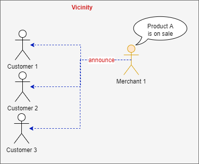

# Overview

The Actor is the most important part of the system.
The Actor performs many duties that the user in the corresponding role does.

The expectations for the Actor should be higher than it is for a service in the traditional application.
The Actor should handle bad input the same way an actual user would handle a poor paper copy of information, for example.
In that case, the user still finds a way to process the request.
The Actor should attempt to do the same if possible.
Of course, the exception to this rule is something like a banking transaction that must complete fully or be rolled back.

The developer should build the Actor with the level of intelligence that is appropriate based on the business and technical vision.
At the low end, an Actor can simply be a renamed microservice with an asynchronous API.
At the high end, the Actor may contain machine learning logic and other capabilities.

There is a reason developers like tools like IntelliJ.
While using it, the tool seems to think for us and greatly help in our behalf.
It is rare to find a person to say IntelliJ has slowed them down.
This is the level of software we should all strive for.
This is what we expect out of an Actor-based application.

## Features

### Memory

An Actor's memory is a form of cache at the process or container level.
It is attached to the Actor and should be serialized and deserialized with the Actor.

It is based on a short-memory concept where it has a most recently used strategy.
If a fact is not recalled or updated after a period of time it is forgotten and removed.
This behavior will produce a natural shared-nothing cache in the process.

#### Remember


```java
        merchant.remember("hotselling-product", "Fishing Rod");
        merchant.remember("items-out-of-stock", 14, Integer.class);
```

The code snippet above shows the use of memory.
The items to remember are based on the nature of the Actor and application.

#### Recall


```java
        Integer itemsOutOfStock = merchant.recall("items-out-of-stock", Integer.class).get();
        Object hotSellingProductName = merchant.recall("hotselling-product").get();
```

The memorized items can be recalled from memory if they have not been forgotten.


#### Notes


Periodically, an Actor will record its memory in notes.
These notes are stored in the Vicinity in case the Actor is unable to perform duties due to some problem.

#### Learning


Periodically, an Actor of the same group, such as the Merchant group, will read in notes from another Actor to learn from them.
This helps keep the cache of information alive if one Actor goes down.
This behavior happens inherently, but the Bulletin board, and Notes objects are also available for other communication for custom behavior.

This default learning does not represent the limit of the ability of an Actor to learn.
A developer can add custom behavior to any Actor to perform Machine Learning or any AI capability.

### Communication

When Actors communicate it is considered a conversation called a Convo.

#### Say


The standard way for Actors to communicate is to say something.

##### Non-blocking
```java
        var event = new ViewProductsEvent(this, name(), "Merchant")
                .setCriteria(criteria)
                .setRequestId(localEvent.getRequestId());

        say(event);
```

The snippet above sends an asynchronous request to any available member of the Merchant Group.
The handling of the response is performed in a handler that will be discussed later.

##### Blocking
```java
    public List<Product> viewProducts(ArchitectureFirstEvent localEvent, ShowProductsCriteria criteria) {
        SimpleModel returnData = new SimpleModel();

        var event = new ViewProductsEvent(this, name(), "Merchant")
                .setCriteria(criteria)
                .setRequestId(localEvent.getRequestId())
                .shouldAwaitResponse(true)
                .initFromDefaultEvent(localEvent);

        say(event, response -> {
            if (response instanceof ViewProductsEvent) {
                var evt = (ViewProductsEvent) response;
                returnData.put("products", evt.getProducts());
                log.info("products have arrived");
                return true;
            }
            return false;
        },
        exception -> {
            log.error("Exception: ", exception);
            return true;
        });

        log.info("return products");
        return (List<Product>) returnData.get("products");
    }
```

The snippet above sends a message to a Merchant and waits for the response.
The code calls setRequestId to have a common thread to identify the related response.


#### Announce



An Actor will announce something that will be sent to the group.

```java
            announce( new ProductOnSaleEvent(this, name(), "Customer")
                    .setProduct(product)
                    .setRequestId(SecurityGuard.getRequestId())
            );
```

#### Whisper


An Actor has personal space in the Vicinity.
The only Actor that is allowed in the personal space is a Security Guard.
The Security Guard protects the Actor from invalid communication.

If the Actor chooses to whisper then the communication stays in the personal space.
In an environment such as Kubernetes or Docker, this personal space is represented as a Container.

```java
        var orderSupplyProductsEvent = new OrderSupplyProductsEvent(this, this.name(), this.name())
                .addProduct(productId, orderQuantity);
        whisper(orderSupplyProductsEvent);
```


#### Reply

```java
        PaymentFailureEvent replyEvent = new PaymentFailureEvent(source, from, originalEvent.from());
        replyEvent.setOriginalEvent(originalEvent);
        say(replyEvent);
```

As shown above, an Actor can reply by creating a new event and linking it to the original one.
Doing this will copy the request id, security token and other important platform information.

```java
        OrderConfirmationEvent replyEvent = fromForReplyWithoutPayload(from, source, originalEvent);
        replyEvent.addPayload(originalEvent.payload());
        replyEvent.setAccessToken(originalEvent.getAccessToken());
        say(replyEvent);
```

In the above approach, the Actor is copying the header information and separately adding payload information before replying.

```java
    protected static Function<ArchitectureFirstEvent, Actor> noticeUserTokenRequest = (event -> {
        UserTokenRequestEvent evt = (UserTokenRequestEvent) event;
        IdentityProvider identityProvider = (IdentityProvider) event.getTarget().get();

        UserToken userToken = identityProvider.authenticateUser(originalUserToken);
        userToken.setUserId(originalUserToken.getUserId());

        identityProvider.say(new UserTokenReplyEvent(identityProvider, identityProvider.name(), event.from())
                .setCustomerToken(userToken)
                .setOriginalEvent(event));

        return identityProvider;
    });
```

In the snippet above, the Identity Provider has received a UserTokenRequestEvent, but replied with a different event called UserTokenReplyEvent.

#### Hearing


When a message is sent through the Vicinity, it is published directly to the target Actor.
Each Actor has 2 connections to the Vicinity. 
One for itself and the other for group communication such as announcements.
This is shown below.

```java
        // subscribe to events
        vicinity.subscribe(this, name());   // subscribe to my event
        vicinity.subscribe(this, group());  // subscribe to a group event
```

To hear a specific message, an Actor must register behavior.
The code below shows this configuration.

```java
    @Override
    protected void init() {
        super.init();
        registerBehavior("ViewProducts", Merchant.hearViewProductsRequest);
        registerBehavior("ViewProduct", Merchant.hearViewProductRequest);
        registerBehavior("CheckoutRequest", Merchant.hearCheckoutRequest);
    }

    protected static Function<ArchitectureFirstEvent, Actor> hearViewProductRequest = (event -> {
        var evt = (ViewProductEvent) event;
        final Merchant ths = (Merchant) AopContext.currentProxy();

        evt.setProduct(ths.showProduct(evt));
        evt.reply(ths.name());
        ths.say(evt);

        return ths;
        });

    public CartItem showProduct(ViewProductEvent event) {
        var product = warehouse.getProductById(event.getProductId());

        Merchant ths = (Merchant) AopContext.currentProxy();
        ths.suggestProductsForCustomer(event);

        return CartItem.from(product);
        }
```

To hear the ViewProductEvent, there must be a static event handler, such as hearViewProductRequest.
The handler has to be registered for the desired message.
The method can do the work itself or call a member method on the Actor.

In this case, the method calls the Actor's showProduct method, which gets the product from the database.
To keep with the business metaphor, the database is referred to as a warehouse.

In the showProduct method, the Actor will proactively suggest products to the caller.
This is a benefit of the conversational approach.
More can be accomplished in a Convo than can be done in a one way request/response approach, unless the request/response has a heavy payload.

**Note**: If an Actor does not understand an Event, meaning there is no handler registered for the event it replies with an ActorDoesNotUnderstandEvent.

### Thinking

The basic thinking on an Actor is straight-forward and not AI driven.

The Actor performs the following overridable behavior based on an internal schedule.

#### Do Once

```java
    /**
     * Perform the one time action
     */
    protected void onDoOnce() {
        //... override
    }
```
The Actor performs a task one time when it starts.

#### Do every __ minutes

```java
    /**
     * Perform processing every 30 minutes
     */
    protected void on30min() {
        // override for specific behavior
        if (logic.existsFor30min()) {
            applyLogic("30min");
        }
    }

    /**
     * Perform processing every hour
     */
    protected void on60min() {
        recordNotes();
        if (logic.existsFor60min()) {
            applyLogic("60min");
        }
    }

    /**
     * Perform processing every 12 hours
     */
    protected void on12hours() {
        // override for specific behavior
        if (logic.existsFor12hours()) {
            applyLogic("12hours");
        }
    }

    /**
     * Perform processing every 24 hours
     */
    protected void on24hours() {
        // override for specific behavior
        if (logic.existsFor24hours()) {
            applyLogic("24hours");
        }
    }
```

The Actor performs actions for every interval above.
For instance, on30min is called every 30 minutes.

#### Check Health

The Actor checks the health of itself and the environment every minute.
This assures the environment is healthy for processing.

```java
    /**
     * Check the health of the Agent and the Vicinity.
     * Terminate if unhealthy
     */
    protected void checkHealth() {
        if (!isHealthOk()) {
            onTerminate("self health not ok for: " + name());
        }

        if (!isVicinityHealthOk()) {
            onTerminate("vicinity connections are stale for: " + name());
        }

        if (!isEnvironmentOk()) {
            onTerminate("environment is invalid for: " + name());
        }

        giveStatus((!isAway)
                ? BulletinBoardStatus.Status.Active
                : BulletinBoardStatus.Status.Away, "running");
    }
```

The snippet above shows the Actor checking the health.
If the situation is not healthy the Actor will self-Terminate to get the attention of monitoring tools.
In some situations, the Actor will re-instantiate itself.

If everything is Ok, the Actor will give its status as running.

#### Proactivity

Every minute (a.k.a. pulse), the Actor will look for work if there is possible work to do.

```java
    /**
     * Perform proactive tasks
     */
    protected void onThink() {
        // Perform periodic processing
        if (isMyTurn()) {
            doMyWork();
        }

        handleUnacknowledgedEvents();
        lookForWork();
    }
```

In the snippet above, the Actor checks to see if it is its turn to process work.
If so the Actor will perform work for the given group.

The Actor will also look for unacknowledged events to process them.
These events include To-Do tasks.

### Other Callbacks

There are additional callbacks that have base logic but can be overriden.
It is recommended to call the base class method when overriding and add additional logic.

#### On Actor Entered

```java
    /**
     * Perform an action when an actor of the same group enters the Vicinity
     * @param event
     */
    public void onActorEntered(ActorEnteredEvent event) {
        // ... override for different behavior
        if (StringUtils.isNotEmpty(JOIN_TOKEN) && JOIN_TOKEN.equals(event.getJoinToken())) {
            if (StringUtils.isNotEmpty(OVERRIDE_TOKEN) && OVERRIDE_TOKEN.equals(event.getOverrideToken())) { // allow another Actor to take the work
                log.warn(String.format("Actor %s is standing down due to override request from %s", name(), event.from()));
                giveStatus(BulletinBoardStatus.Status.Away, "standing down");
                isAway = true;
            }
        }
    }
```

This method represents a notification of an Actor entering the Vicinity.
The method has default behavior to support a JOIN group where all Actors contain a common token.
This allows for an Actor to override other Actors in the group and process all messages.
It must be announced.

#### On Actor Resume

```java
    /**
     * Resume activities if standing down
     * @param event
     */
    public void onActorResumeRequest(ActorResumeEvent event) {
        // ... override for different behavior
        if (StringUtils.isNotEmpty(JOIN_TOKEN) && JOIN_TOKEN.equals(event.getJoinToken())) {
            if (StringUtils.isNotEmpty(OVERRIDE_TOKEN) && OVERRIDE_TOKEN.equals(event.getOverrideToken())) { // allow another Actor to take the work
                log.warn(String.format("Actor %s is resuming down due to request from %s", name(), event.from()));
                giveStatus(BulletinBoardStatus.Status.Active, "running");
                isAway = false;
            }
        }
    }
```

This method will reinstate actors that stood down on request.
It must be announced.

#### On Error

```java
    public void onError(String message) {
        ...
    }
```

This method handles an error that is not based on an event or exception.
The default logic is to log the error in the Actor's log location.


#### On Exception

```java
    public void onException(ActorException exception, String message) {
        ...
    }
    public void onException(ArchitectureFirstEvent event, ActorException exception, String message) {
        ...
    }
```

This method handles an exception during the Actor's processing.
By default, the exception is logged, sent to the Vicinity Monitor and the original Actor.

#### On Unhandled Event

```java
    @Override
    protected void onUnhandledEvent(ArchitectureFirstEvent event) {
        // .. override to handle
        log.warn("unhandled event: " + event.toString(), event);
    }
```

This method allows for custom behavior if an event is not handled or understood by the target Actor.


#### On Actor Processing Error

```java
    @Override
    protected void onActorProcessingError(ActorProcessingErrorEvent event) {
        var msg = event.message();
        log.error(msg);

        if (msg.contains("Exception:")) {   // Return a technical support message
            msg = String.format("%s %s.  Please contact the technical support team",
                    (StringUtils.isNotEmpty(event.getRequestId())) ? "RequestId: " + event.getRequestId() : "",
                    (event.getTarget().isPresent() ? "/ " + event.getTarget().get().name() : "")
            );
        }
        var clientEvent = new DefaultLocalEvent(event.getRequestId())
                .setOriginalEvent(event)
                .setTo(CLIENT)
                .setFrom(name());
        clientEvent.payload().put("error", msg);
        clientEvent.payload().put("status", 505);
        client.say(clientEvent);
    }
```

This method is called when there is an error during processing of a Convo.
The snippet above is from the Customer that will intelligently interrogate the message and inform the client user.


#### On Terminate

```java
    @Override
    protected void onTerminate(String reason) {
        ...
    }
```

This method is called to allow an Actor to gracefully terminate.

## Links
- [Overview](Overview.md 'Overview')
- [Concepts](Concepts.md)
- [Vicinity Features](Vicinity-Features.md 'Vicinity Features')
- [Messaging](Messaging.md)
- [Special Features](Special-Features.md)
- [Troubleshooting](Troubleshooting.md)
- [Tips and Tricks](Tips-and-Tricks.md)
- [Getting Started](../../README.md)