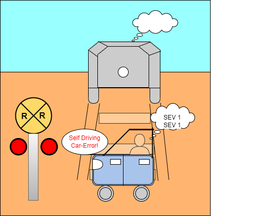

# Concepts

## There is no app

The idea for building applications is focused on capturing business logic in the problem domain.
In the ideal scenario, the application is modeled after a technique called the [Architecture-First](https://tonymarius.substack.com/p/architecture-first-strategy?utm_source=url) strategy.
In this case, the requirements are defined and the Actors and Use Cases are identified.

The Use Cases should be business-focused instead of application-focused.
This approach will lead to reusable Actors that span applications.
The effort can help to split up a monolithic application into microservices successfully because, if a microservice is only used by one application it is a lot of effort for minimal gain.

Since users generally span multiple applications to get their work done, an Actor modeled after the same role will naturally span applications.


In the diagram above, the same Merchant is serving both the Storefont for shoppers and the Vendor Portal for vendors.

## Business Metaphor


The goal is to hide details inside simple concept objects that mirror the real world.
For instance, in the retail showcase application, the Storefront, Bulletin board, etc. are defined in Redis while the Warehouse and User Registry is defined in MongoDB.
The developer of the Actor is hidden from the technical details so the logic remains simple and business-focused.


```java
    @TaskTracking(task = "merchant/ShowProducts", defaultParentTask = "customer/ViewProducts")
    public List<? extends IProduct> showProducts(ViewProductsEvent event) {
        // Try to get products from storefront.  If they are not there then get from warehouse
        var optionalProducts = storefront.getProducts(event.getCriteria(), Product.class);
        var products =  (optionalProducts.isPresent())
                ? optionalProducts.get()
                : warehouse.getProducts(event.getCriteria());

        /* At step 1, the merchant cannot find available products.
            2.1 The merchant notifies the customer.*/
        // Note: This will also notify other interested customers in the vicinity
        if (products.size() == 0) {
            say(new NoProductsAvailableEvent(this, this.name(), event.from())
                    .setRequestId(event.getRequestId())
                    .setAccessToken(event.getAccessToken()));
            rememberOccurrence("No Products found for criteria", event.getCriteria().getJsonCriteria());
        }
        else {
            if (optionalProducts.isEmpty()) {
                storefront.addProducts(event.getCriteria(), products);
            }
        }

        return products;
    }
```

On the snippet above, the code clearly reflects the Use Case.
From a technical perspective, it actually performs caching by storing recent products in Redis, but the code looks like natural business logic.
The business logic is not lost in lots of technical details.

Below, is the corresponding Use Case.


| Name | Description|
| -----| -----------|
|ID | M01|
|Name| Show Products|
|Actors| Merchant, Customer|
|Preconditions| |
|Triggers| The customer has attempted to view products via (C01 - View-Products).|
|Main Flow| 1. The Merchant finds products from inventory based on criteria.<br/> 2. The Merchant displays the corresponding products.|
|Alternate Flows| At step 1, the Merchant cannot find available products.<br/>2.1 The Merchant notifies the Customer.<br/>2.2 The Use Case ends.|
|Exceptions| At step 2, due to technical difficulties, the Merchant cannot display the products.<br/>2.1 The Merchant notifies the Customer.<br/>2.2 The user case ends.|
|Postconditions| The Merchant has displayed the desired products.|

Note: For the exception, the communication of 'technical difficulties' is provided by the framework.

## Roles


The roles are implemented by separate Actors.
With this approach, an Actor such as the Retail Manager can access a database that is inaccessible to the Customer.
The Retail Manager can still interact with the Merchant just like the Customer can.
Though the Retail Manager can interact with the Merchant it may send different messages.

## Proactive


The Actors are designed to be proactive.
In the diagram above, the request/response interaction would start at step 1 and end at step 2.
In the proactive approach, the Actor should perform additional value-add behavior if possible.
In this case, in steps 3, 4 and 5 the Merchant is suggesting products to the Customer as the Customer looks at a particular product.
This is likely to happen in real life with human interactions.
We want to develop the Actor with similar behavior.

Periodically, the Merchant checks the inventory status to see if any changes are needed.
If some inventory is low the Merchant will order some replacement items.

## Error Handling


Error handling in a distributed environment is more difficult than it is in a monolith.
Errors have to be handled in the microservice and also propagated back the interested party, such as a user or Technical Support.

In BOA, an exception is caught by the platform and naturally sent to the Vicinity Monitor as well as the original caller.
The Vicinity Monitor ('channel: VicinityMonitor') is a channel that can be monitored by subscribing.

The exception is also naturally logged.
As in a conversation, the attribute that binds the exception to the request is the request ID.

```java
        Object proceed = null;
        try {
            proceed = joinPoint.proceed();
        }
        catch (Throwable t) {
            failTask(conn, t.getMessage());
            log.error("Error:", t);
            requestContext.setException(t);
            actor.onException(eventParam, new ActorException(actor,  new RuntimeException(t))); <-- Handler
        }

```

```java
            catch(Exception e) {
                var evt =  new VicinityConnectionBrokenEvent(this, "vicinity", owner.name())
                        .setOwner(owner.name())
                        .setTargetOwner(target)
                        .setVicinity(this)
                        .setTargetActor(owner);
                owner.onException(evt, new ActorException(owner, e), "Vicinity Error:"); <-- Handler
                publisher.publishEvent(evt);
            }
```
The two snippets above show some error handling at various locations that are built to call the Actor.onException method.

```java
    /**
     * Perform an action based on an exception
     * @param event - event that was being processed
     * @param exception - exception that was caught
     * @param message - custom message related to the exception
     */
    public void onException(ArchitectureFirstEvent event, ActorException exception, String message) {
        if (event != null) {
            if (event.toFirst().equals(name())) {
                var errorEvent = ActorProcessingErrorEvent.from(this,  event, exception);
                errorEvent.setMessage(message);
                log.error(errorEvent.message());

                convo.record(event, Conversation.Status.ErrorAfterReceivedByActor);
                say(errorEvent);
                return;
            }
        }

        var reportEvent = new ActorProcessingErrorEvent(this, name(), VICINITY_MONITOR)
                .setException(exception);
        log.error(message, exception);
        announce(reportEvent);
    }
```
In the snippet above, the default behavior on the Actor handles the error and sends it back to the caller as well as the Vicinity Monitor.

```java
    @Override
    public void onException(ArchitectureFirstEvent event, ActorException e, String message) {
        log.error((StringUtils.isNotEmpty(message)) ? message : "Error: ", e);
        var msg = (StringUtils.isNotEmpty(message)) ? message : e.getMessage();
        if (msg.contains("CART_NOT_AVAILABLE")) {
            msg = "CART_NOT_AVAILABLE You must add a product before checking out";
        }
        if (msg.contains("Exception:")) {   // Return a technical support message
            msg = String.format("%s %s.  Please contact the technical support team",
                    (StringUtils.isNotEmpty(event.getRequestId())) ? "RequestId: " + event.getRequestId() : "",
                    (e.getActor() != null) ? "/ " + e.getActor().name() : ""
            );
        }
        var clientEvent = new DefaultLocalEvent(event.getRequestId())
                .setOriginalEvent(event)
                .setTo(CLIENT)
                .setFrom(name());
        clientEvent.payload().put("error", msg);
        clientEvent.payload().put("status", 504);
        client.say(clientEvent);
    }
```
In the snippet above, the Customer has overridden the onException method to intelligently interpret the error.
Based on the analysis, the Customer will notify the client user with a friendly message.

## Built-in Gains

Using the real world metaphors can lead to more robust and performant coding without losing the business logic within lots of technical details.
For instance, the retail showcase application performs caching by using a metaphor that is easy to understand.


The developer can naturally code high performance code during initial development instead of waiting until there is a problem.
For instance, the Merchant is coded to store highly accessed information in the Storefront (e.g. cache).
It can safely do this if the Merchants are the main accessors to the database for products.
The Merchants will be aware of any inventory changes.

If a Merchant cannot find a particular product in the Storefront, the Merchant can retrieve the product from the Warehouse (e.g. database).
This is natural behavior and is something that an actual worker in the real world would do.
This makes the logic and architecture understandable for both the developer and the user.

```java
    public List<? extends IProduct> showProducts(ViewProductsEvent event) {
        // Try to get products from storefront.  If they are not there then get from warehouse
        var optionalProducts = storefront.getProducts(event.getCriteria(), Product.class);
        var products =  (optionalProducts.isPresent())
                ? optionalProducts.get()
                : warehouse.getProducts(event.getCriteria());

        if (optionalProducts.isEmpty()) {
            storefront.addProducts(event.getCriteria(), products);
        }

        return products;
    }
```

In the snippet above, as described in our goals, the Merchant looks for products in the Storefront first.
If the products are not found in the Storefront, the Merchant will find the product in the Warehouse and add it to the Storefront.
This produces natural caching that is understandable by developers and non-developers.

## Model Use Cases

As shown in previous sections, the Actors should closely resemble an actual user role.
The Actor's logic should map to Use Cases.
This will help define not only the happy path, but the exception path and result in logic to handle the scenarios.

## Extensibility and Grid Computing Support

Actors can run in a Kubernetes cluster, a Docker Swarm, a Docker Compose environment, and a native environment that has access to the Redis Vicinity.
In essence, the runtime model supports grid computing from any available platform.


The Vicinity is an environment that transcends the particular runtime environments.
This is similar to accessing a database from various locations, except it is based on processing instead of data.

## Robustness

An Actor should be resilient like a human is when something goes unexpectedly.
For instance, if you show up to a store to return a product and are missing a receipt the manager can still find your sale by using your credit card and grant a refund.
Both you and the manager end the situation on a happy note.

It is too often that an application fails in production producing a SEV 1 situation when the problem is minor, such as finding that a field is missing on a POJO for the results of a query.
Unless the results of the action are invalid due to the lack of this field, the application should issue a warning and not an error that prevents the user from using the system.

An Actor is expected to be backward compatible where new fields that the code is not ready to use are ignored and do not cause a failure.
Meanwhile, if the Actor is pointing to an old version of the database it should resort to previous behavior that exists in the previous release and not fail.
The code should at least support the current and previous releases for ease of rolling forward and backward.
It is up to the team to determine how far back the compatibility will go.
The decision should be based on code and version support complexity.

If at all possible, the code should provide degraded support if there is degraded input and not just fail.
Who enjoys standing in line at a Motor Vehicle Agency or equivalent for an hour only to find out that one entry on a form was not filled out correctly and being sent back to the end of the line?
I don't know anybody who likes that.
Why do applications work that way?
Who enjoys filling out wizards online only to find out some piece of information is missing so the entire session must be discarded?

The backward-compatibility and degraded-experience approach allows for easier releases in a microservice environment.
We still want to fail fast if we have to fail, but let's reduce the times there is a complete failure.
We also want to provide as much information as usable in the error log to quickly find the problem.
This does not mean randomly log everything, but instead carefully plan the logging strategy so that a technical support person can resolve the issue without calling you for help.

The architecture definition can help make some problems go away or at least reduce their severity.
For instance, there are many things that can go wrong in the relational database that have to be handled.
There is no one size fits all solution so each situation must be evaluated separately.

A discussion of some issues and strategies to increase robustness are below.
- Since the full object structure is broken apart, the relational database requires linking by foreign keys.
  - If the key is a surrogate key (a.k.a. identity key or sequence) the key must be passed around to get all the data we need
    - If there is no referential integrity (RI) we can get incorrect data.
      - That is a SEV 1
    - If the application has a bug and uses the wrong ID then we can get incorrect data
      - That is a SEV 1
  - In a NoSql database, like MongoDB or JSON supported in Oracle, Sql Server, etc.
    - The data is already joined together so no surrogate key is needed most of the time
      - If there is no surrogate key then it cannot get lost, and we cannot have orphaned data
        - This eliminates a whole class of show-stopper and hard to fix problems.
        - Granted, we must trust the application to properly store and validate data
- In Kubernetes we have control of the pod and can handle databases in a different way
  - For instance, it is possible to embed a database in the pod itself if the data is only used by the Actor or microservice
    - The database in this case is likely changed in lock step with the code.
      - This reduces the chance for application vs. database sync problems
      - It also reduces connectivity issues
        - Note: I am not recommending this approach unilaterally, but I am just pointing out that we can and should do things to reduce production issues.
          - Your Business and Technical Support teams thank you :)

For one last example, is there a way to store data temporarily if the database goes down?
The database is smart enough to store requests in a transaction log or MongoDB oplog so that it can restore itself if it goes down.
Is there anything we can do on the Actor and microservice level?
Lets think about it as we start to code.
I don't want my self-driving car stuck at a broken traffic light because it does't know what to do.
Worse yet, I don't want it stopped on train tracks because the gates went down when we are already on the track.



## Links

- [Overview](Overview.md 'Overview')
- [Vicinity Features](Vicinity-Features.md 'Vicinity Features')
- [Actor Features](Actor-Features.md)
- [Messaging](Messaging.md)
- [Special Features](Special-Features.md)
- [Troubleshooting](Troubleshooting.md)
- [Tips and Tricks](Tips-and-Tricks.md)
- [Getting Started](../../README.md)