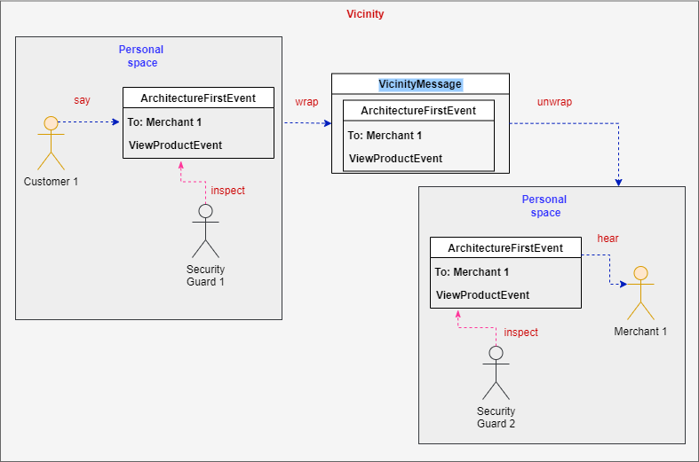

# Messaging

The default communication for BOA is asynchronous and is performed thorugh messages.



Internally, events are extensions of an ArchitectureFirstEvent.
In a containerized application, such as Docker or Kubernetes, personal space is represented as a Container.

If the event is not a local type, such as produced by a whisper, it is wrapped by the Vicinity into a VicinityMessage.
The Vicinity routs this message to the desired targets.
Each target has a subscription into a Redis channel based on the Actor's name and the Actor's group.
Therefore, the message is routed directly to the Actor.

There is a Security Guard in each personal space that checks both ingoing and outgoing messages.
If a message is invalid to send the error is sent back to the source Actor.

On the receiving end, if a Security Guard detects an invalid message it will reject it and send the error back to the originating Actor as well as report it to the Vicinity Monitor.

## ArchitectureFirstEvent

The ArchitectureFirstEvent contains important routing information as well as the desired payload.
It is divided up between a header and a payload.
It is ok to have properties outside the header and the payload as long as there is a translator on the sending and receiving ends.

### Header

| Property    | Description                                                                                                                                         |
|-------------|-----------------------------------------------------------------------------------------------------------------------------------------------------|
| from        | The Actor's name()                                                                                                                                  |
| to          | A list of group() names or individual actor names                                                                                                   |
| requestId   | A generated ID to represent the conversation or Convo                                                                                               |
| jwtToken    | An expirable token containing information for accessing the system. It is up to the system designers to determine what needs an access token or not |
| boa-conn    | A connection string for communication with the client, such as websockets                                                                           |
| boa-project | A project name for an actor to receive specific messages.  Default is 'defautl'.                                                                    |
| originalEventName    | The name of the starting event in a Convo                                                                                                           |


### Payload

The payload is a dynamic field that is based on a SimpleModel, which encapsulates a Map.
The field can contain anything, but it is the responsibility of the receiver to translate the fields to a POJO or equivalent.
If the default behavior is adequate then no intervention is necessary, otherwise the event should cast the fields to the correct type or override onVicinityInit to format the desired fields.

```java
    @Override
    public void onVicinityInit() {
        if (this.payload().get("productId") instanceof Double) {
            setProductId(((Double) this.payload().get("productId")).longValue());     // Convert Gson default data type
        }
    }
```

The snippet above uses a custom solution to map a Double to a long due to the default translation of Gson.
This translation can be avoided if there are mapping definitions for Gson for desired classes.
Regardless, this is a hook for performing custom behavior during translation.

### Message Linking

Messages are linked so the entire conversation can be tracked.
In some cases the original code is blocking and waiting for the response for a particular event.
The requestId allows for the message to be linked properly.


Note: In the diagram above, the events are showing just the header information.

As the first step, the Customer creates and says a message (ViewProductEvent).
Due to the framework, most of the header information shown is automatically supplied in the creation of the ViewProductEvent.

The important item, called requestId, is highlighted.
This key field links the Convo and Task list together.

When the Merchant hears the message it creates a ViewProductReplyEvent.
The Merchant then calls the setOriginalEvent method to copy values and ensure that the Convo continues.
If this step is not done a new requestId will be created and it will be considered a new Convo.

#### Monitoring

At this time, it is recommended to use a tool, such as [Redis Commander](https://www.npmjs.com/package/redis-commander) to monitor the application.


In the image above, the request for View Product has a requestId of o2mQjEylCu4iZJRbvVQn.
The requestId is tracked in 4 objects

1. UnAck - The list of unacknowledged messages by order
   1. This is not shown here because all messages were acknowledged.
   2. If a message ends up in the [RequestId]/UnAck list an Actor of the target group will pick it up and process it.
2. Ack - The list of acknowledged messages by order

   1. In this case, only one message is acknowledged since the same message is used during sending and replying.
3. Convo - The list of messages sent back and forth and the status

   1. This conversation is updated live and an event can have the following status

```java
        Starting ("Starting"),
        Replying ("Replying"),
        SendingViaVicinity ("SendingViaVicinity"),
        ReceivedInVicinity ("ReceivedInVicinity"),
        ReceivedByActor ("ReceivedInVicinity"),
        AcknowledgedByActor ("AcknowledgedByActor"),
        ErrorAfterReceivedByActor ("ErrorAfterReceivedByActor");
```
   The Convo statuses help for troubleshooting in the asynchronous environment.
4. Tasklist - The list of tasks as part of a use case that are performed by the participating actors.

   1. The Tasklist shows the steps of the use case as they are being worked on.
   2. There are extra items, such as SuggestProducts because the Actor proactively contacted the Customer during the ViewProduct use case.

```java
    @TaskTracking(task = "merchant/ShowProduct", defaultParentTask = "customer/ViewProduct")
    public CartItem showProduct(ViewProductEvent event) {
```
In order to participate in a Task list, the method must be decorated with a TaskTracking annotation.
The first parameter must also be an ArchitectureFirst event.

## Links

- [Overview](Overview.md 'Overview')
- [Concepts](Concepts.md)
- [Vicinity Features](Vicinity-Features.md 'Vicinity Features')
- [Actor Features](Actor-Features.md)
- [Special Features](Special-Features.md)
- [Troubleshooting](Troubleshooting.md)
- [Tips and Tricks](Tips-and-Tricks.md)
- [Getting Started](../../README.md)