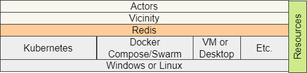
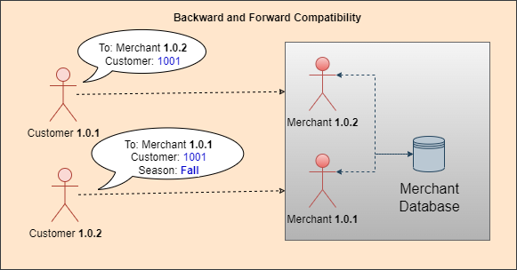

# Overview

Computer software and applications have come a long way. 
There was a time when all processing was done on a mainframe against tapes.
This evolved into two and three tier applications against relational databases.
The next great leap was Web programming, which eliminated difficult deployment and support for client machines.

The latest of the major industry changes is the move to the Cloud.
The Cloud has removed many of the barriers of the 'on prem' environments and opened up new opportunities.
Some of those opportunities include distributed computing, machine learning, high availability and the ability to create smarter programs.

## New Opportunities

The new opportunities allow an application to interact with a user instead of just obeying commands.
For instance, the application may push messages to the browser or a chat application.

Outside the traditional application, there are now self-driving cars and smart appliances.
There are also smart traffic lights that change timing based on live traffic.
There is an ever-growing list of smart devices.
The opportunities to provide added value for the user is better than ever before.

There now exists a powerful platform for applications, nicknamed the Cloud.
The components in the Cloud give us more opportunities to build applications that meet and exceed the users' expectations.

We want to do more than produce a grid that a user uses to export data to Excel to do analysis only to input some data back into the system.
We want to do the processing that the user exported the data for if possible.
The goal is to make the user's job easier and not to simply move data around.

The retail showcase application demonstrates some techniques for coding to the desired value-add goals.
The application uses the Business Oriented Architecture (BOA) approach of the [Architecture-First](https://tonymarius.substack.com/p/architecture-first-strategy?utm_source=url) strategy.

These goals include:
- Writing smarter programs
  - Smarter programs will benefit the users and make their jobs more productive
  - It is not a requirement, but the technique allows for AI, such as machine learning
- Maintaining a business focus
  - The business logic and rules should be clearly visible in the application
  - The logic should support traceability to any Use Cases written beforehand
- Producing robust applications
  - The goal of each service should be high availability 
  - The service should support various information sources
- The service should handle adversity
  - The service should survive and potentially process even if the data is not complete
    - An exception to this goal is when there is a transaction that must be completed entirely to produce accurate results
    - Errors that cannot be handled should be clearly communicated to technical support or the user
- The service should be proactive
  - Perform important duties during idle time
    - For example, include code for purging data rather than forgetting to code it until there is a problem.
  - Communicate with the user without the user having to perform an action first.
    - For example, push notifications such as an order status to a mobile phone or browser

## Philosophy

The service in this approach is called an Actor.
This Actor, such as the Merchant or Cashier, is built to be more intelligent than a traditional service, such as the products-service or billing-service.
The Actor should model the user that is using the system and not just the processes in the system.
We will ask better questions when we model the system based on what the user does rather than the data the user needs.
The answers to these questions will help to build the desired system.

The diagram above shows the Actors that will be referred to in the documentation.
The software included in the retail showcase application has code for each of these Actors.
The retail application is described in the [Getting Started](../../README.md) documentation.
It supports native Java, NodeJS, Docker Compose and Kubernetes.

### There is no application

The users most likely use multiple applications to get their work done.
In modeling the Actor, we want to account for the entire workflow even if some processing will be done outside the new code for a period of time.
There are business reuse opportunities with this approach.

This concept is further discussed in the [Concepts](Concepts.md) document.

### Take advantage of a Cloud-Centric architecture

Most people reading this already know some advantages of a Cloud-Centric architecture.
One of the major advantages is the knocking down of walls between applications.
This allows for reuse that was difficult before.

Another advantage is the built-in grid-computing support in platforms, such as Kubernetes.
The Cloud platforms make it easy for scaling up and scaling down machines without paying for idle CPUs.

### Default to Asynchronous Communication

Asynchronous communication allows for long-running tasks without the timeout issues.
An example of this communication is the 'publish/subscribe' model.
This technique is easier to scale and does not require a front load balancer for each endpoint.

With the async approach, it is recommended that the actor pushes information to the client.
To facilitate this on the browser, the standard approach is to use websockets.

### Peer to Peer Communication

Instead of the standard request/response communication, the BOA approach uses peer-to-peer communication.
This communication path runs both ways and is not unidirectional.

Even though there appears to be more coupling than the unidirectional approach, the coupling is avoided because the interaction is essentially with an interface.
This distributed strategy is discussed further throughout the document.

As part of the Vicinity metaphor, the actors can communicate with any actor in the Vicinity.
To aid in system flexibility, the actors dynamically register and perform interactions.
As stated before, the medium for communication is Redis.

### Innate Behavior

The actors naturally communicate to achieve the desired results.
They are built in a bottom-up style once they have been defined.
The developers should focus on each Actor's interface and behavior and then integrate with other Actors being developed.

If necessary, the actor has the ability to acquire new behavior dynamically based on a script of business rules.
In other words, an Actor can learn.

### Concept Simplicity

The actor interacts with human understandable objects that hide the underlying technology.
The utility items represent similar concepts that the actual user may use if operating outside the computer.

In the diagram above, there is a Bulletin board, Task list and To-Do list.
Though these items are backed by Redis and require the Redis API to use them the components offer a developer friendly interface.

## Vision

Like anything new, the platform (or runtime environment) will start out small.
The goal is to continue to grow to allow for more available resources.

The platform will run on any of the environments in gray shown in the image above.
The preferred runtime environment is Kubernetes or Docker Compose/Swarm because of the grid-computing capabilities.
But, since the Actor is just a running process, it can run directly on a VM, desktop or another environment.

The key component that ties the Vicinity together is Redis.
All BOA native asynchronous communication uses it.
Since it is an open-source platform, Redis can be swapped out with another communication mechanism, but currently only Redis is supported.

By relying only on Redis, there is support for a ubiquitous environment.
For instance, an Actor running on the desktop can communicate with an Actor running on Kubernetes, Docker, etc.

Besides, the built-in security, it is up to each deployment to provide packet-level security, such as whitelisting Redis port access.
It is also up to each deployment to configure passwords for Redis as this current release does not require a password.

### Actor Repositories

The world of containerization allows for bundling a deployable application in a ready to use form.
For BOA, the vision includes the ability to download a usable Actor that comes in a running mode.
The BOA Hub pictured in the diagram may be real or virtual.
For instance, the images may come from Docker Hub, Azure or AWS Container Repository, or a private repository.

Since this is a human metaphor, we want to employ or hire this Actor.
We will expect this Actor to hit the ground running and provide useful work just like a real employee.
And if performing machine learning or similar then training is expected.

The BOA concept mentions machine learning and AI, but it is not required.
It is only required to follow the principles of robustness and Actor focused logic.

In the scenario above, a GerbalTax Accountant is employed for an application.
It is expected that a UI can attach to this Actor, or that it comes with a built in interface.
There should be minimal installation required to use it.

### Smart Actor

The expectation of this Actor is different from some garden variety services.
In some services, the burden is on the user of the service to carefully map to the service's API to use it correctly.
Any mistake leads to frustration, because the developers of the service only support a narrow path of usage.
This path is often poorly defined and tested.

The smart Actor should support a variety of inputs and be easy to work with.
This is the same way we feel about coworkers and how they feel about us.
That is our standard to code to.

In the top diagram above, the Accountant was written in a limited fashion where it only supports XML.
This helped out the Gerbal Tax developers, because they had less to do, but it made reuse very difficult.
More than likely, the Merchant developers went elsewhere for the processing that was needed.
Nobody likes working with APIs like that.

In the bottom diagram, the Gerbal Tax Accountant was written to consume a variety of input.
The Gerbal Tax Accountant developers may have built mapping logic into the Actor as the first step inside the container.
This is preferred over putting the burden on the Merchant developer to find some ETL application just to use the Gerbal Tax Accounting service.
It is easy to conclude, that the smart Actor has a higher chance of reuse.

This reuse benefits the organization, which now does not have duplicate processes to manage.
Let's write applications to this standard.

## AI Approach

The image above links to an AI Maze based on the same concepts supported in the platform.
The Actors are built to be as smart as ants and will navigate through a moving maze.
They can see the information necessary to make decisions.
They are smart and will work properly in any maze that provides the API that they can access.

Giving Actors the runtime information they need to process correctly is another principle in this approach.

Applications can be this smart.
This can eliminate many headaches that are due to integration with fragile happy path endpoints.

## 12-Factor Principles of Microservices

The platform strategy generally adheres to the 12-Factor App Principles of microservices

- Dependencies (Explicitly declare and isolate the dependencies)
  - _The dependencies are based on Actors defined in the business design step_
- Config (Store configurations in an environment)
  - _This is the default in a containerized environment_
- Backing Services (treat backing resources as attached resources)
  - _Not only are the resources treated as attachments, they are conformed to a business metaphor to make it simpler_
- Build, release, and Run (Strictly separate build and run stages)
  - _The runtime is based on images that are built earlier and employed from a image repository_
- Processes (execute the app as one or more stateless processes)
  - _The Actors are essentially stateless, but may contain caching information in memory._
    - _This will not hurt the system, because if an Actor goes down another can still serve the request._
      - _This is similar to a restaurant where a new waiter can help serve a customer if the original one goes home._
- Port Binding (Export services via port binding)
  - _This is naturally handled by the container deployment_
- Concurrency (Scale out via the process model)
  - _Scaling in the platform can occur inside or outside Kubernetes_
- Disability (maximize the robustness with fast startup and graceful shutdown)
  - _The Actors communicate when they have validated the environment and are ready for processing._
    - _They shut down after processing their last requests and notify the Vicinity so that other Actors can take up new work._
- Dev/prod parity (Keep development, staging, and production as similar as possible)
  - _The Actor is based on an image that is the same in all environments._
- Logs (Treat logs as event streams)
  - _This is an inherent feature of Docker and Kubernetes_
- Admin processes (Run admin/management tasks as one-off processes)
  - _The environment supports a combination of cron jobs and self-initiated activities at the Actor thread level._

As stated above, many of these goals are achieved using the Kubernetes/Docker containerized solutions.

## Loose Coupling

Separating out microservices doesn't help if they are actually coupled into a distributed monolith.
It is important to analyze whether a feature should be solved by two separate microservices or one combined microservice.
The answer is case by case and based on analysis.

With the [Architecture-First](https://tonymarius.substack.com/p/architecture-first-strategy?utm_source=url) strategy, the BOA Actor division is a nice reason to split an application.
Alternatively, the non-BOA technique to split a microservice is based on process breakdowns.

The diagram above, shows two approaches for designing microservices.

### Potential Microservice Architecture

In the top diagram, the microservices are designed based on categories of processing.
At first this seems like a logical choice.
Our process breakdown approach may lead us to this design.

The Problems with this approach can be seen right away.
Orders and Products are split into services and collections of tables, but are actually tightly coupled.
If a caller wants to get Products for an Order it must make multiple calls to the Product Service for each Order returned by the Order Service.
This approach is expensive and hard to maintain.

Also, any change to the Order Service or Product Service API can break the Customer Service.
There is little upside to this microservice split.

### Actor-based Microservice

In the bottom diagram, the service is split by actor role. 
Since a Merchant deals with both Orders and Products, it can access the database without the complexity of service-to-service communication.
If a developer changes the access methods to the database it does not affect the caller.

This design is not limited to the BOA approach, but the BOA approach can lead to a simpler application structure.
The BOA approach also lines up nicely with a company's organizational structure.
Regardless of this benefit, just like in Use Cases, the Actors should be designed around roles and not job positions.

## Backward and Forward Compatibility

For the sake of resilience, microservices should be designed in a backward and forward compatible fashion.
The exception is if the previous application API was completely wrong and is producing results that must be fixed immediately.

If there is a new parameter added to a request in generation 1.0.2 it should honor the requests sent in the format for generation 1.0.1.
There should be a policy to honor X number of versions of code and gradually deprecate the previous APIs when possible.

This will aid the Blue/Green deployment where a new generation and old generation can run together for a period of time.
Rollbacks become much easier with this strategy.

Correspondingly, the 1.0.1. code should not break with a new parameter that it does not recognize.
The code should log a warning that a field is not supported or ignore it altogether.

Based on requirements and the project strategy, the Actor that does not understand a command can also put the message in a To-Do list or a Queue for another Actor who understands the message to pick up and process.
This is considered the Escalate Request technique.

The key to backward compatibility is to fashion the code to handle features for a period of time.
In the diagram above, there are two version of the Merchant as well as 2 versions of the Customer.
We want to welcome this instead of constantly fighting this situation with the standard versioning techniques.

In our scenario, the Merchant 1.0.2 has some new feature, and it also involved a database change.
In this case, the developers of the Merchant have decided to make non-breaking changes to support the new feature.
This is beneficial because who likes to use libraries that are constantly making breaking changes?

Because the changes are backward compatible, the new Merchant 1.0.2 can coexist with Merchant 1.0.1 for a period of time.
This makes code releases much easier.

From the API perspective, the Merchant has added a new field called Season that refers to the new field populated in the database.
When Customer 1.0.2 interacts with Merchant 1.0.2 the field is expected and everything is fine.
But if Customer 1.0.2 interacts with Merchant 1.0.1 there could be an error as Merchant 1.0.1 is not expecting this new field.

Since Merchant 1.0.1 was written to be forward compatible, it does not break and just ignores this field.
The Customer is still served even though some new features are not returned.

If Customer 1.0.1 interacts with Merchant 1.0.2 without the new Season field Merchant 1.0.2 should not fail.
It should behave the same way Merchant 1.0.1 would and return the data in the previous release's format.
This can be achieved by including Merchant 1.0.1 code in Merchant 1.0.2 or running both simultaneously.

An exception to this philosophy is the situation where the new field must be supported or the results are invalid.
In this case, the Actors handling mismatched message versions should return an error or attempt to pass off the work to an Actor of the proper version.

## Links
- [Concepts](Concepts.md)
- [Vicinity Features](Vicinity-Features.md 'Vicinity Features')
- [Actor Features](Actor-Features.md)
- [Messaging](Messaging.md)
- [Special Features](Special-Features.md)
- [Troubleshooting](Troubleshooting.md)
- [Tips and Tricks](Tips-and-Tricks.md)
- [Getting Started](../../README.md)

## Tutorials
- [Tutorial: Hello Actor](Tutorials-Hello-Actor.md)
- [Tutorial: Merchant Convo](Tutorials-Merchant-Convo.md)