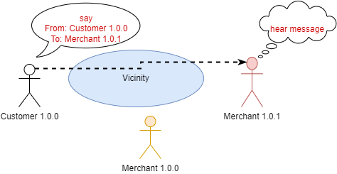
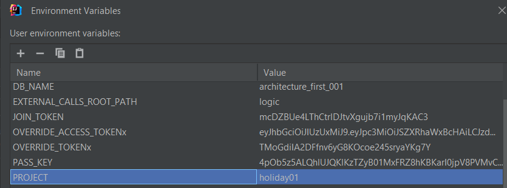
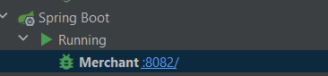
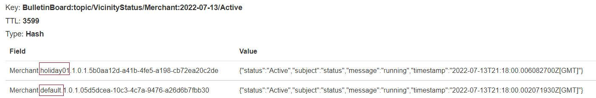
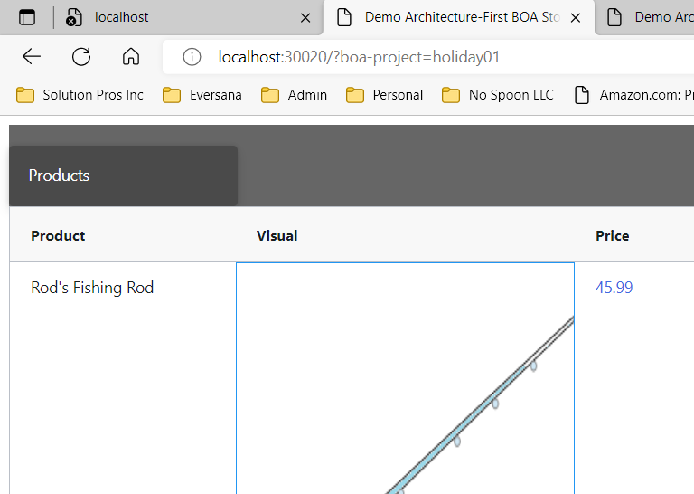
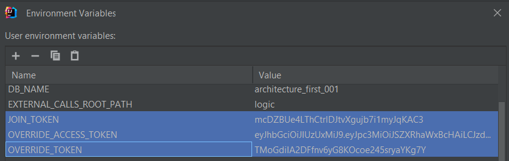
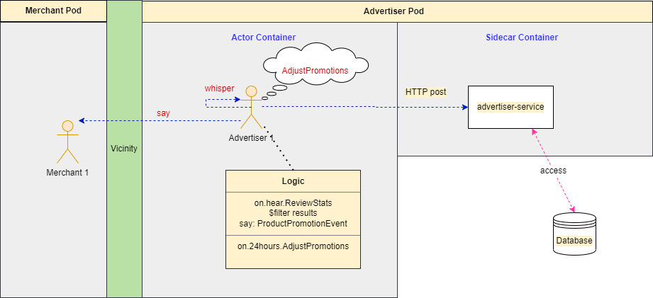

# Special Features

There are additional features that work with the strategy.

## Generation

The philosophy allows for Actors of different versions to coexist in the same Vicinity.
In keeping with the human metaphor, the version is called a generation.



In the diagram above, both generations of the Merchant exist in the Vicinity.
By default, the messages will alternate in a round-robin fashion.
This scenario can support a form of A/B testing where a percentage of messages will be sent to the new generation and the rest to the other generation for a slow rollout.

### Blue/Green deployment
Blue/Green deployment is supported by using the boa-project attribute



Define the project variable in the debugger or deployment yaml if Docker or Kubernetes.



Run the Actor's process.



View the bulletin board (via [Redis Commander](Tips-and-Tricks.md#install-redis-commander)) to see when Actor is ready to receive messages.
This is the case where the Actor's status is "Active" and "running".
We are looking for the 'holiday01' project Actor.



Add the boa-project with the desired name to the URL.

```java
            if (Utilities.project()) {
                httpSettings.headers["boa-project"] = Utilities.project();
            }
            const response = await fetch('/api/customer/checkout', httpSettings);
```

For a REST call, add the entry to the headers and call any Actor with the project 'holiday01'.

If the communication is using a message instead the boa-project attribute must be added the Event header.

When the steps are complete, the messages with the boa-project attribute will route to Actors with the corresponding value.
If no Actor with the attribute value is found the message will route to one of the default project Actors.


## Overriding

Overriding works similar to the boa-project behavior except conversations will not alternate with other Actors.
The other Actors will move their statuses to "Away" and stand down until a message is sent to resume.

```java
    /**
     * Support overriding other Actors in the same group and receive all events
     */
    protected void handleOverriding() {
        JOIN_TOKEN = System.getenv("JOIN_TOKEN");
        OVERRIDE_TOKEN = System.getenv("OVERRIDE_TOKEN");
        OVERRIDE_ACCESS_TOKEN = System.getenv("OVERRIDE_ACCESS_TOKEN");

        if (StringUtils.isNotEmpty(OVERRIDE_TOKEN)) {
            log.warn(String.format("Actor %s is attempting to override actors in group %s", name(), group()));
        }

        announce(new ActorEnteredEvent(this, name(), group())
                .setAccessToken(OVERRIDE_ACCESS_TOKEN)
                .setJoinToken(JOIN_TOKEN)
                .setOverrideToken(OVERRIDE_TOKEN)
        );
    }
```

For overriding, the original Actors must run with both the JOIN_TOKEN and OVERRIDE_TOKEN defined.
If the Actor that wants to override defines the same OVERRIDE_TOKEN and JOIN_TOKEN in the environment the other Actors in the same group will stand down.

Also, the Actor must specify a valid OVERRIDE_ACCESS_TOKEN for security purposes or the request will be rejected.



```yaml
spec:
  replicas: 1
  selector:
    matchLabels:
      platform: boa
      app: retail
      service: merchant
  template:
    metadata:
      labels:
        platform: boa
        app: retail
        service: merchant
    spec:
      containers:
        - name: merchant
          image: boaretail_merchant
          ports:
            - name: svc-port
              containerPort: 8082
          env:
            - name: JOIN_TOKEN
              valueFrom:
                configMapKeyRef:
                  name: boa-env
                  key: JOIN_TOKEN
            - name: OVERRIDE_TOKEN
              valueFrom:
                configMapKeyRef:
                  name: boa-env
                  key: OVERRIDE_TOKEN
```
This snippet shows the original configuraton of the Merchant.
Notice the JOIN_TOKEN and OVERRIDE_TOKEN configured for the pod.


## Dynamic Actor

One of the features that will be developed further in the future is the Dynamic Actor.
This actor is not written with standard Java code.
It is a base object that executes logic based on a JSON script.

This actor can execute commands against a Kubernetes sidecar and other non-BOA services.



The diagram above shows a Kubernetes layout.
As desired, each pod has one main Actor (minus the Security Guard).
The Actor is part of the BOA platform and requires a developer to install the vicinity-platform and write Java code to use it. 

There are some situations where there is existing code and the goal is merely to interact the existing code with the platform.
The Dynamic Actor helps with this approach.
The Dynamic Actor is built to be downloaded as an image and then scripted to communicate with a sidecar or other Actors without Java coding.
Therefore, the sidecar service can be written in a another language.

The early version is limited and only supports a few commands, but will grow in the future.
The ideal state is to download existing Actors into a Kubernetes cluster or Docker Swarm without the need to compile.

An example of the current script is shown below.

```json
{
  "define": {
    "AcquireCrossSellProducts": "com.architecture.first.framework.business.retail.events.AcquireCrossSellProductsEvent",
    "CrossSellsUpdated": "com.architecture.first.framework.business.retail.events.CrossSellsUpdatedEvent",
    "AcknowledgeImpression": "com.architecture.first.framework.business.retail.events.AcknowledgeImpressionEvent",
    "UpdateAvailability": "com.architecture.first.framework.business.retail.events.UpdateAvailabilityEvent"
  },
  "declare": {
    "brand-value": "'Ray-ban'"
  },
  "on": {
    "hear": {
      "AcquireCrossSellProducts": [
        {
          "$exec": {
            "whisper": {
              "name": "AcquireCrossSellProducts",
              "extern": true
            }
          }
        },
        {
          "$filter": "$.results[?(@.brand == {{brand-value}})]"
        },
        {
          "$exec": {
            "say": {
              "name": "CrossSellsUpdated",
              "to": "Merchant",
              "payload": {
                "products": "$$pipeline.results"
              }
            }
          }
        },
        {
          "$exec": {
            "call": {
              "name": "AcknowledgeImpression",
              "payload": {
                "data": "$$pipeline.results"
              }
            }
          }
        }
      ]
    },
    "30min": [
      {
        "$exec": {
          "call": {
            "name": "UpdateAvailability"
          }
        }
      }
    ]
  }
}
```

The logic above represents a pipeline of commands.
These commands work with base logic on the Actor.

They coordinate with a plugin for making external calls.
Each actor can actually support this, but the Dynamic Actor is built to have no native logic.

```json
{
  "AcquireCrossSellProducts": {
    "headers": [],
    "method": "GET",
    "uri": "http://localhost:3001/advertiser-service/api/crosssells",
    "params": ["type=Sunglasses"],
    "body": {}
  },
  "AcknowledgeImpression": {
    "headers": [],
    "method": "POST",
    "uri": "http://localhost:3001/advertiser-service/api/impression/ack",
    "params": [],
    "body": {}
  },
  "UpdateAvailability": {
    "headers": [],
    "method": "POST",
    "uri": "http://localhost:3001/advertiser-service/api/availability/update",
    "params": [],
    "body": {}
  }
}
```

The commands above tie with the logic script in the previous section.

## Links

- [Overview](Overview.md 'Overview')
- [Concepts](Concepts.md)
- [Vicinity Features](Vicinity-Features.md 'Vicinity Features')
- [Actor Features](Actor-Features.md)
- [Messaging](Messaging.md)
- [Troubleshooting](Troubleshooting.md)
- [Tips and Tricks](Tips-and-Tricks.md)
- [Getting Started](../../README.md)
