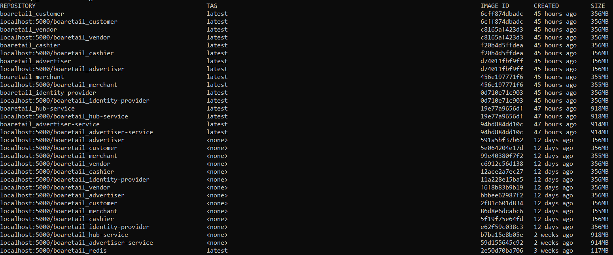
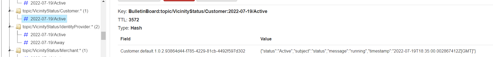

# Troubleshooting

This document contains a list of issues and potential resolutions.

## Wrong code version running.

Whether you are using a local registry or a public container registry make sure that the desired code is running.

```shell
docker images
```



Ensure that the code running matches the image expected.
The image dates are one clue.

Check the log to see if the Actor generation is the expected one.

```shell
istening for transport dt_socket at address: 5006

  .   ____          _            __ _ _
 /\\ / ___'_ __ _ _(_)_ __  __ _ \ \ \ \
( ( )\___ | '_ | '_| | '_ \/ _` | \ \ \ \
 \\/  ___)| |_)| | | | | || (_| |  ) ) ) )
  '  |____| .__|_| |_|_| |_\__, | / / / /
 =========|_|==============|___/=/_/_/_/
 :: Spring Boot ::                (v2.6.4)

2022-07-06 20:46:15.278  INFO 1 --- [           main] c.a.f.f.b.r.m.c.CustomerApplication      : Starting CustomerApplication v1.0.0-SNAPSHOT using Java 17-ea on customer with PID 1 (/customer.jar started by root in /)
2022-07-06 20:46:15.285  INFO 1 --- [           main] c.a.f.f.b.r.m.c.CustomerApplication      : No active profile set, falling back to 1 default profile: "default"
2022-07-06 20:46:20.098  INFO 1 --- [           main] o.s.b.w.embedded.tomcat.TomcatWebServer  : Tomcat initialized with port(s): 8084 (http)
2022-07-06 20:46:20.111  INFO 1 --- [           main] o.apache.catalina.core.StandardService   : Starting service [Tomcat]
2022-07-06 20:46:20.111  INFO 1 --- [           main] org.apache.catalina.core.StandardEngine  : Starting Servlet engine: [Apache Tomcat/9.0.58]
2022-07-06 20:46:20.196  INFO 1 --- [           main] o.a.c.c.C.[Tomcat].[localhost].[/]       : Initializing Spring embedded WebApplicationContext
2022-07-06 20:46:20.196  INFO 1 --- [           main] w.s.c.ServletWebServerApplicationContext : Root WebApplicationContext: initialization completed in 4768 ms
2022-07-06 20:46:20.243  INFO 1 --- [           main] f.a.AutowiredAnnotationBeanPostProcessor : Autowired annotation is not supported on static fields: private static org.apache.catalina.core.ApplicationContext com.architecture.first.framework.security.SecurityGuard.applicationContext
2022-07-06 20:46:20.244  INFO 1 --- [           main] f.a.AutowiredAnnotationBeanPostProcessor : Autowired annotation is not supported on static fields: private static java.lang.String com.architecture.first.framework.security.SecurityGuard.privateKey
2022-07-06 20:46:20.980  INFO 1 --- [           main] c.a.f.f.b.v.bulletinboard.BulletinBoard  : bulletinBoardConnectionId: b4d41f71-8d20-4925-968c-b8f3577f3f12
2022-07-06 20:46:20.992  INFO 1 --- [           main] c.a.f.f.b.vicinity.tasklist.Tasklist     : tasklistConnectionId: 4d4c08d1-93ea-47fa-b92b-22c263edae76
2022-07-06 20:46:21.311  INFO 1 --- [           main] c.a.f.f.business.vicinity.vault.Vault    : vaultConnectionId: cfa2858e-3d88-437e-a9cc-e0cb3f318720
2022-07-06 20:46:21.313  INFO 1 --- [           main] c.a.f.framework.business.actors.Actor    : actorId: SecurityGuard.default.1.0.0.903349cc-2f13-4d95-892a-b18b203c3263
2022-07-06 20:46:21.314  INFO 1 --- [           main] c.a.f.f.business.vicinity.Vicinity       : Subscription to: channel: SecurityGuard.default.1.0.0.903349cc-2f13-4d95-892a-b18b203c3263
2022-07-06 20:46:21.322  INFO 1 --- [           main] c.a.f.f.business.vicinity.Vicinity       : Subscription to: channel: SecurityGuard
2022-07-06 20:46:21.843  INFO 1 --- [           main] org.mongodb.driver.cluster               : Cluster created with settings {hosts=[boa-retail-db-service:27027], mode=SINGLE, requiredClusterType=UNKNOWN, serverSelectionTimeout='30000 ms', maxWaitQueueSize=500}
2022-07-06 20:46:22.024  INFO 1 --- [           main] c.a.f.framework.business.actors.Actor    : actorId: Customer.default.1.0.1.ffe7d489-c2a7-4c69-a3c1-c83902c6ce52

```

The last line above shows the generation as 1.0.1 and the default project. 
Make sure that the results of the log matches with the generation in the code.

```java
    public Customer(CustomerRepository repository, ClientCommunication client) {
        this.repository = repository;
        this.client = client;
        setGeneration("1.0.1");
    }
```

## The Actor is not getting the messages.

Interrogate the Redis environment to see if the proper generation is running.

```shell
boa-retail-redis-service:6389> hgetall "BulletinBoard:topic/VicinityStatus/Customer:2022-07-19/Active"
1) "Customer.default.1.0.1.93864d44-f785-4229-81cb-4492f597d302"
2) "{\"status\":\"Active\",\"subject\":\"status\",\"message\":\"running\",\"timestamp\":\"2022-07-19T18:32:00.001358643Z[GMT]\"}"
```

Note: The command above was executed from a redis-cli utility pod.
An example command is shown below on a redis image named redis-cli.

```shell
kubectl exec -it redis-cli -- redis-cli -h boa-retail-redis-service -p 6389
```

The alternative is to use Redis Commander.



It usually takes the Actor 1 minute to check the environment and sign up on the Bulletin board.
Therefore, it is unable to get messages before that time.

## Links
- [Overview](Overview.md 'Overview')
- [Concepts](Concepts.md)
- [Vicinity Features](Vicinity-Features.md 'Vicinity Features')
- [Actor Features](Actor-Features.md)
- [Messaging](Messaging.md)
- [Special Features](Special-Features.md)
- [Tips and Tricks](Tips-and-Tricks.md)
- [Getting Started](../../README.md)

## Tutorials
- [Tutorial: Hello Actor](Tutorials-Hello-Actor.md)
- [Tutorial: Merchant Convo](Tutorials-Merchant-Convo.md)