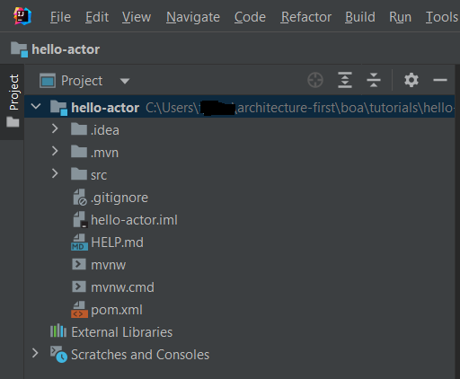
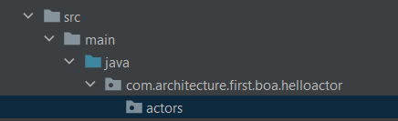
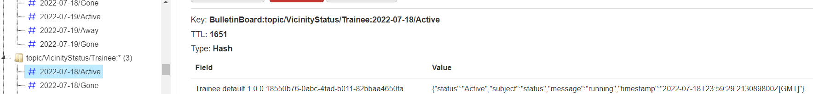

# Hello Actor

This tutorial will show the steps to create a simple Actor.

## Prerequisites

The retail showcase application is running as a Docker Compose application or in a local Kubernetes Cluster as described in [Getting Started](../../README.md).

## Steps

### Create a new application.



### Add dependencies

```xml
		<dependency>
			<groupId>com.architecture.first</groupId>
			<artifactId>vicinity-platform</artifactId>
			<version>1.0.0</version>
		</dependency>
		<dependency>
			<groupId>redis.clients</groupId>
			<artifactId>jedis</artifactId>
			<version>4.2.0</version>
		</dependency>
```

### Create package



### Create Trainee class

```java
package com.architecture.first.boa.helloactor.actors;

import com.architecture.first.framework.business.actors.Actor;

@Service
public class Trainee extends Actor {
}
```

### Create application.yml
```yaml
server:
  port: 9191

redis:
  host: localhost
  port: 30389 #30389 for Kybernetes and 16379 for Docker Compose
```

Note: Change the redis.port to 16379 if running in Docker Compose.

### Create an Event Handler in the Trainee class

```java
    protected static Function<ArchitectureFirstEvent, Actor> hearMessageEvent = (event -> {
        System.out.println(event.payload().get("message"));

        return event.getTarget().get();
    });
```

### Register Event Handler in the Trainee class

```java
    @Override
    protected void init() {
        super.init();

        registerBehavior("Message", Trainee.hearMessageEvent);
    }
```

### Full Class Definition

```java
@Service
public class Trainee extends Actor {

    @Override
    protected void init() {
        super.init();

        registerBehavior("Message", Trainee.hearMessageEvent);
    }

    protected static Function<ArchitectureFirstEvent, Actor> hearMessageEvent = (event -> {
        System.out.println(event.payload().get("message"));

        return event.getTarget().get();
    });
}
```

### Create Message Event

Create a com.architecture.first.boa.helloactor.events package and Create the following class.

```java
package com.architecture.first.boa.helloactor.events;

import com.architecture.first.framework.business.vicinity.events.AnonymousOkEvent;
import com.architecture.first.framework.technical.events.ArchitectureFirstEvent;

public class MessageEvent extends ArchitectureFirstEvent implements AnonymousOkEvent {
    public MessageEvent(Object source, String from, String to) {
        super(source, from, to);
    }
}
```

### Add Component Scan to the Application

#### The snippet below shows the Actor in the com.architecture.first package
```java
import org.springframework.boot.SpringApplication;
import org.springframework.boot.autoconfigure.SpringBootApplication;
import org.springframework.context.annotation.ComponentScan;

@ComponentScan(basePackages = "com.architecture.first")
@SpringBootApplication
public class HelloActorApplication {

	public static void main(String[] args) {
		SpringApplication.run(HelloActorApplication.class, args);
	}

}
```

#### The snippet below shows the Actor in the com.example.boahello package
```java
package com.example.boahello;

import org.springframework.boot.SpringApplication;
import org.springframework.boot.autoconfigure.SpringBootApplication;
import org.springframework.context.annotation.ComponentScan;

@ComponentScan(basePackages = {
        "com.architecture.first",
        "com.example.boahello"
})
@SpringBootApplication
public class BoaHelloApplication {

    public static void main(String[] args) {
        SpringApplication.run(BoaHelloApplication.class, args);
    }

}
```
Note: The Actor's path above is added to the Component Scan.

### Create Test Class

```java
package com.architecture.first.boa.helloactor;

import com.architecture.first.boa.helloactor.actors.Trainee;
import com.architecture.first.boa.helloactor.events.MessageEvent;
import org.junit.jupiter.api.Test;
import org.springframework.beans.factory.annotation.Autowired;
import org.springframework.boot.test.context.SpringBootTest;
import org.springframework.util.Assert;

@SpringBootTest
class HelloActorApplicationTests {

	@Autowired
	private Trainee trainee;

	@Test
	void testHelloWorld() {
		var event = new MessageEvent(this, "Tester", "Trainee")
				.setAsRequiresAcknowledgement(false);
		event.payload().put("message", "hey there world");

		trainee.whisper(event);
		Assert.isTrue(true, "No testing needed :)");
	}

}
```

### Run the test

```shell
2022-07-18 20:20:09.358  INFO 31752 --- [           main] c.a.f.b.h.HelloActorApplicationTests     : Started HelloActorApplicationTests in 3.109 seconds (JVM running for 4.377)
2022-07-18 20:20:12.870  INFO 31752 --- [           main] c.a.f.framework.business.actors.Actor    : Publishing event: com.architecture.first.boa.helloactor.events.MessageEvent[source=com.architecture.first.boa.helloactor.HelloActorApplicationTests@31b6fb14]
2022-07-18 20:20:22.757  INFO 31752 --- [           main] c.a.f.framework.business.actors.Actor    : Receiving event: {"header":{"from":"Tester","to":["Trainee.default.1.0.0.697202cd-a8a2-411c-8e63-6357f30cc86c"],"requestId":"VVSOAHQYkEhT8eaRh5AF","originalEventName":"MessageEvent"},"payload":{"message":"hey there world"},"message":"","isPropagatedFromVicinity":false,"isLocalEvent":true,"isAnnouncement":false,"wasHandled":false,"awaitResponse":false,"awaitTimeoutSeconds":30,"isPipelineEvent":false,"hasErrors":false,"isReply":false,"requiresAcknowledgement":false,"isToDoTask":false,"toDoLink":"","processLaterIfNoActorFound":false,"originalActorName":"","tasklist":"","index":0,"timestamp":1658190012865}
hey there world
```

### Success

Note: A whisper is a message that stays in the personal space (a.k.a Container)

### Bulletin board



You will notice that the Trainee has registered with the Bulletin board.
Please follow instructions on installing Redis Commander [here](Tips-and-Tricks.md#install-redis-commander).

## Tutorials
- [Next Tutorial: Merchant Convo](Tutorials-Merchant-Convo.md)

## Links
- [Overview](Overview.md 'Overview')
- [Concepts](Concepts.md)
- [Vicinity Features](Vicinity-Features.md 'Vicinity Features')
- [Actor Features](Actor-Features.md)
- [Messaging](Messaging.md)
- [Special Features](Special-Features.md)
- [Troubleshooting](Troubleshooting.md)
- [Tips and Tricks](Tips-and-Tricks.md)
- [Getting Started](../../README.md)
