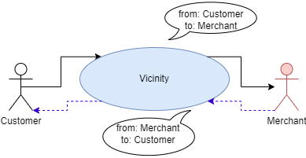
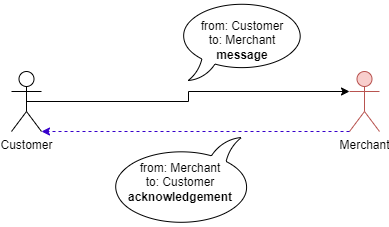
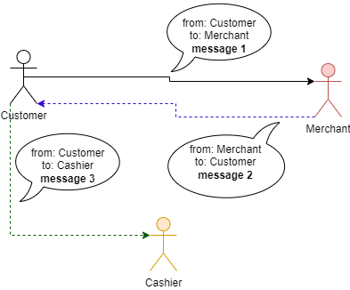
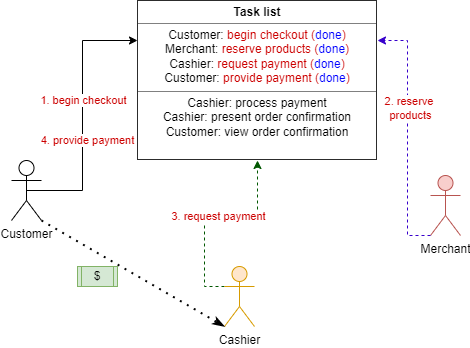
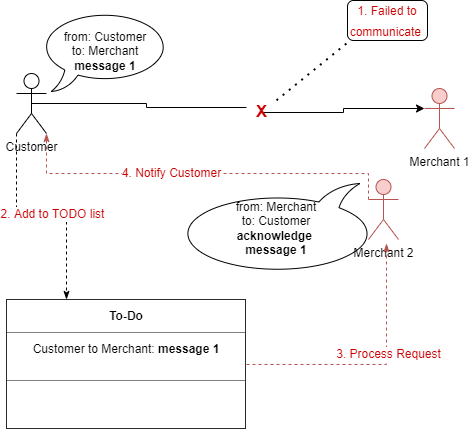
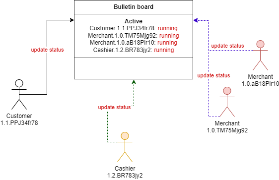

# Vicinity Features

## Asynchronous Default Behavior

The Actor begins communication with another Actor, which is called a conversation (a.k.a. Convo).
The target Actor can respond multiple times based on need instead of only one request and one response.

In the asynchronous case, the Customer is not waiting for the Merchant to reply.
The Merchant replies at some point later after some work was performed.
The same Actors can be involved in multiple conversations just like a human could.

The Customer can also wait for the response from the Merchant if it is required.
The blocking behavior is discussed in the Actor and Messaging documentation.

## Acknowledgement

Unless specified otherwise, the target Actor will acknowledge any message that it received back to the sender.

## Conversation

One or more Actors can participate in a Conversation.
Each conversation is linked together by a common request ID.

## Task list

A Task list is used for tracking a use case between Actors.
Each Actor updates the status when they are finished with their tasks.

## To-Do list

If an Actor has a problem communicating with an intended Actor it can place the request in a To-Do list.
Another Actor of the same group will monitor the list and process the request instead.
This strategy can help prevent message loss.

## Bulletin board

The bulletin board is used to find Actors to communicate with to accomplish tasks.
The available Actors continually update their statuses on the bulletin board.
If an Actor no longer updates its status to running it will be removed from the Active board and will no longer receive messages.

As shown in the diagram, Actors of different versions can work together.

## Links
- [Overview](Overview.md 'Overview')
- [Concepts](Concepts.md)
- [Actor Features](Actor-Features.md)
- [Messaging](Messaging.md)
- [Special Features](Special-Features.md)
- [Troubleshooting](Troubleshooting.md)
- [Tips and Tricks](Tips-and-Tricks.md)
- [Getting Started](../../README.md)
